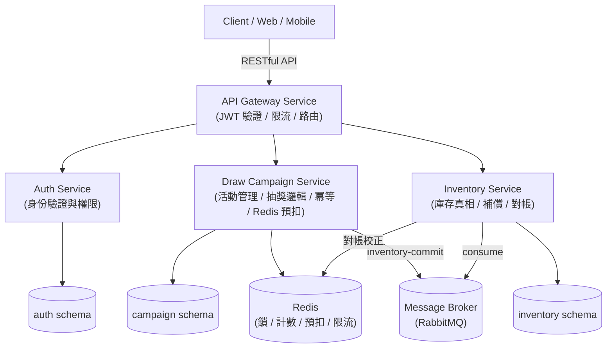

# lucky-draw-system

Lucky Draw System (電商轉盤抽獎微服務系統)

lucky-draw-system 是一個基於 Java 21 與 Spring Boot 3 打造的高可用、分散式電商轉盤抽獎平台。支援動態獎品機率配置、防重複抽獎與防超抽風控機制，並提供地端與雲端（GCP）環境的可擴展架構。

## 🚀 技術棧 (Tech Stack)

核心語言與框架: Java 21, Spring Boot 3.x, Spring Cloud Gateway, Spring Security + JWT

資料庫 (Database): 

Local/Dev: SQLite / PostgreSQL (Docker)

Prod/GCP: GCP Cloud SQL for PostgreSQL

快取與併發控制: Redis (分佈式鎖 Redlock / Redis Lua Scripts)

容器化與部署: Docker, Docker Compose, GCP Cloud Run / GKE

文件與測試: OpenAPI 3.0 (Swagger), JUnit 5, Mockito, Testcontainers

## 🏛️ 系統架構 (System Architecture)



> 每個服務擁有並只操作自己的資料域（schema），跨服務一律走 API / event。實體部署（單一或多個 PostgreSQL instance）為 infra 細節，見 [ADR-002](docs/adr/002-database-per-service.md)。

### 微服務模組說明

1. **API Gateway Service**: 統一 Entry point，處理 JWT 驗證、Rate Limiting 限流與 API 路由。
2. **Auth Service**: 使用者身份驗證與權限管理。
3. **Draw Campaign Service**: 抽獎活動管理、動態獎品機率配置（銘謝惠顧與各獎品總和 100%）、單次/多次抽獎邏輯，以及風控熱點路徑（防重複抽獎、個人抽獎次數上限、Redis + Lua 預扣庫存）。
4. **Inventory Service**: 庫存真相來源——執行庫存條件扣減（DB 真相，防止超抽）、扣減失敗補償與帳目校對。

---

## 🔒 風控與併發控制機制 (Risk Control & Concurrency)

1. **防止重複抽獎 (Anti-Double-Draw)**:
   - 使用使用者 ID + 活動 ID + 請求冪等 Key（Idempotency Key）配合 Redis 鎖。
   - 檢查活動設定的個人抽獎次數上限。
2. **防止超抽 (Anti-Overselling)**:
   - 採用 Redis 原子性 Lua 腳本進行熱點庫存預扣扣減，成功後異步/事務性寫入 DB。
   - DB 層級採用條件更新（Conditional Update: `UPDATE inventory SET stock = stock - 1 WHERE id = ? AND stock > 0`）確保一致性。

---

## 📂 專案目錄結構 (Project Directory)

```text
lucky-draw-system/
├── docs/                      # 專案文件與設計說明
│   ├── architecture/          # 系統架構圖與設計文件
│   ├── api/                   # API 說明文件 (OpenAPI / Swagger)
│   └── db/                    # DB Schema (DDL, DML, ER Diagrams)
├── app/                       # 後端微服務原始碼 (Java 21 / Spring Boot 3)
│   ├── common/                # 通用 DTO, Exception, Utils
│   ├── api-gateway/
│   ├── auth-service/
│   ├── campaign-service/
│   └── inventory-service/
├── docker/                    # Docker Compose 與建置檔
│   ├── docker-compose.yml     # 地端開發環境 (PostgreSQL, Redis, RabbitMQ)
│   └── .env.example
├── README.md                  # 專案主說明文件
└── AGENTS.md                  # 系統開發流程指引
```

---
## 🛠️ 地端開發與快速啟動 (Local Development)

### 環境需求

Java 21 (JDK 21)

Maven 3.9+ / Gradle 8.x

Docker & Docker Compose

啟動步驟

複製環境設定檔：cp docker/.env.example docker/.env

啟動地端基礎設施：docker-compose -f docker/docker-compose.yml up -d

編譯並執行服務：cd app && ./gradlew build && ./gradlew bootRun
