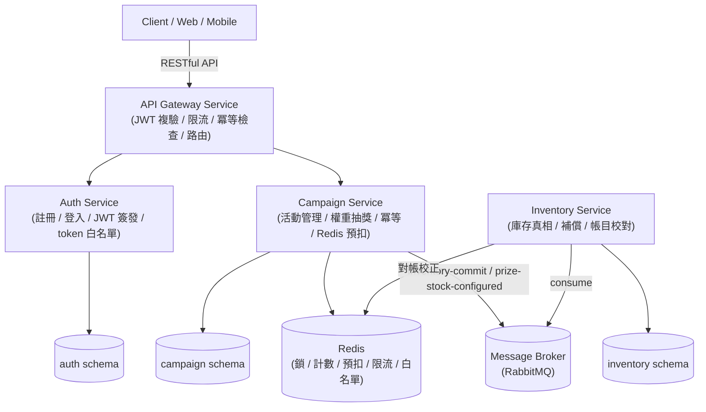

# lucky-draw-system

電商轉盤抽獎微服務系統——以 Java 21 + Spring Boot 3 打造的高可用、分散式抽獎平台。支援動態獎品機率配置、防重複抽獎與防超抽風控，並以「Redis 加速層 + DB 真相層」兩段式設計在高併發下保證「實發 ≤ 庫存」。

> 📌 交付進度見 [docs/roadmap.md](docs/roadmap.md)；測試狀態見 [docs/testing/test-matrix.md](docs/testing/test-matrix.md)；開發流程紀律見 [AGENTS.md](AGENTS.md)。

---

## 系統架構 (System Architecture)



> 每個服務擁有並只操作自己的資料域（schema），跨服務一律走 API / event（ADR-002）。inventory-service 為純後端協作服務（無 REST，事件驅動）。

| 服務 | 職責 |
|------|------|
| **API Gateway** | 統一入口：JWT 複驗、限流（per-user/per-IP）、抽獎冪等 header 檢查、路由、公開功能放行 |
| **Auth Service** | 註冊、登入、JWT（RS256）簽發、JWKS 公開、**token 白名單**（登出 / 同時登入數控管） |
| **Campaign Service** | 活動/獎品管理（狀態機、機率總和 100% 驗證）、權重抽獎（單次/批次）、冪等/replay、Redis 預扣 + 庫存不足降級 |
| **Inventory Service** | 庫存真相來源：條件扣減（絕不為負）、冪等、扣減失敗補償 + 告警、定期帳目校對 |

---

## 核心機制 (Core Mechanisms)

### 防重複抽獎（冪等）
- 抽獎請求帶 `Idempotency-Key`（gateway 缺則 400）。
- 三層防線：Redis SETNX 冪等鎖 → DB `UNIQUE(user_id, campaign_id, idempotency_key, seq)` → replay 逐位元一致回傳（不重抽/不重扣/不重計）。

### 防超抽（兩段式）
- **加速層**：Redis Lua 原子預扣 `GET stock → if > 0 DECR`（低延遲、併發判定）。
- **真相層**：inventory-service 以 `UPDATE inventory SET stock = stock - qty WHERE stock >= qty` 條件更新（DB 為唯一真相，絕不負庫存）。
- 庫存不足 → 抽獎降級銘謝惠顧（不重抽）；真相扣減仍不足 → 補償（REVERSED + 告警 + 對帳收斂）。

### 安全
- JWT **RS256**：auth-service 持 private key 簽發，各服務以 public key **獨立複驗**（defense in depth，不信任 gateway 傳遞的 header）。
- **token 白名單**：登入將 jti 註冊進 Redis（`auth:token:{jti}` + per-user session 集合）；驗證 = 簽章通過 **且** jti 在 Redis（fail-closed）。支援登出撤銷 + 同時登入數上限（超限踢最舊 FIFO）。

### 事件（Spring Cloud Stream + RabbitMQ）
| binding | 方向 | 用途 |
|---------|------|------|
| `inventory-commit` | campaign → inventory | 中獎扣減通知（冪等鍵 drawRecordId） |
| `prize-stock-configured` | campaign → inventory | 獎品 quantity 動態修改的庫存同步（冪等鍵 configVersion） |

---

## 技術棧 (Tech Stack)

- **語言/框架**：Java 21、Spring Boot 3.3、Spring Cloud Gateway、Spring Security + JWT（nimbus-jose-jwt）
- **資料庫**：dev 用 H2（MODE=PostgreSQL）；prod 用 PostgreSQL（`ddl-auto=validate` + Flyway migration，DDL 為真相）
- **快取/併發**：Redis（Lua 預扣、冪等鎖、限流計數、token 白名單）
- **訊息**：Spring Cloud Stream + RabbitMQ（binder 抽象，prod 可換 Kafka）
- **契約/映射**：OpenAPI 3.0 + openapi-generator（`contracts` module）、MapStruct（`unmappedTargetPolicy=ERROR`）
- **測試**：JUnit 5、Testcontainers（Postgres/Redis）、spring-cloud-stream test-binder

---

## 快速開始 (Quick Start)

### 前置
- Java 21、Docker & Docker Compose

### 一鍵回歸驗證（自動化）
```bash
powershell -ExecutionPolicy Bypass -File scripts/smoke-test.ps1
```
> 自動：起 infra → 建置 → 起 4 服務 → 跑 J-1/J-2/J-3 + 負向 → 驗證 → 清理。

### 手動逐步（詳見 [docs/testing/manual-verification.md](docs/testing/manual-verification.md)）
```bash
# 1. 起基礎設施（Redis + RabbitMQ）
docker compose -f docker/docker-compose.yml up -d

# 2. 建置（JDK 21）
cd app && ./gradlew build

# 3. 起 4 服務（各開一個 terminal；建議 auth → campaign → inventory → gateway）
./gradlew :auth-service:bootRun        # :8081
./gradlew :campaign-service:bootRun    # :8082
./gradlew :inventory-service:bootRun   # :8083（無 REST，僅事件）
./gradlew :api-gateway:bootRun         # :8080（唯一對外入口）

# 4. 健康檢查
curl http://localhost:8080/actuator/health
```

### 測試
```bash
./gradlew test              # unit（秒級，dev loop）
./gradlew integrationTest   # integration（Testcontainers，CI/pre-merge）
```

---

## 文件索引 (Documentation Index)

| 目錄 | 內容 |
|------|------|
| [docs/roadmap.md](docs/roadmap.md) | 交付進度（epic 完成 / 未完成 / out of scope） |
| [docs/adr/](docs/adr/) | 架構決策（ADR-001 ~ 012） |
| [docs/specs/](docs/specs/) | 需求（天條 §0 + FR/NFR）與 per-service SA |
| [docs/stories/](docs/stories/) | 使用情境（ST-*）與使用者旅程（J-1/J-2/J-3） |
| [docs/api/](docs/api/) | OpenAPI 3.0、API 清單、錯誤碼、實作方式 |
| [docs/db/](docs/db/) | DB schema（DDL/DML/ER） |
| [docs/testing/](docs/testing/) | 測試矩陣、手動驗證手冊 |
| [docs/rules/](docs/rules/) | 編程規約（naming/exceptions/unit-testing/…） |
| [docs/architecture/](docs/architecture/) | 架構圖、抽獎流程、風控、部署 |

---

## 專案目錄結構 (Project Directory)

```text
lucky-draw-system/
├── docs/                      # 設計與文件
│   ├── adr/                   # 架構決策紀錄
│   ├── specs/                 # 需求（天條 + per-service SA）
│   ├── stories/               # 使用情境 + 旅程
│   ├── api/                   # OpenAPI / API 清單 / 錯誤碼 / impl
│   ├── db/                    # DDL / DML / ER
│   ├── testing/               # 測試矩陣 + 驗證手冊
│   ├── rules/                 # 編程規約
│   └── architecture/          # 架構圖 / 流程 / 風控 / 部署
├── app/                       # 後端微服務原始碼（Gradle 多模組）
│   ├── common/                # 共用（JWT 複驗 / token 白名單）
│   ├── contracts/             # openapi-generator 生成的 DTO/interface（入版控）
│   ├── auth-service/
│   ├── campaign-service/
│   ├── inventory-service/
│   └── api-gateway/
├── scripts/                   # smoke-test.ps1（自動化回歸）
├── docker/                    # docker-compose（Postgres / Redis / RabbitMQ）
├── AGENTS.md                  # 開發流程指引（角色分層 / 契約優先 / 測試紀律）
└── README.md
```
