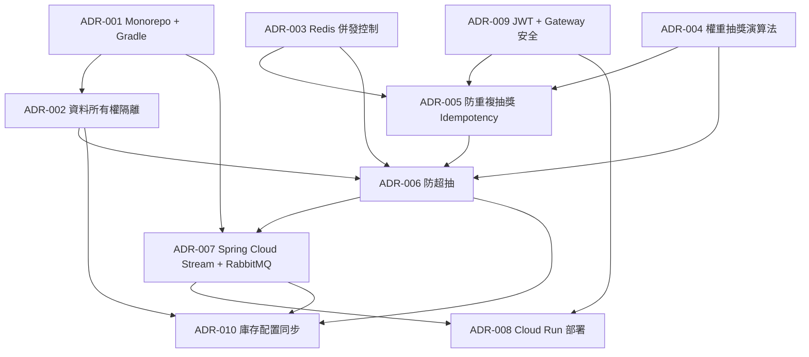

# Architecture Decision Records

本目錄記錄 lucky-draw-system 的架構決策，採用 [Michael Nygard 的輕量 ADR 格式](https://cognitect.com/blog/2011/11/15/documenting-architecture-decisions)（Context / Decision / Consequences / Alternatives），以繁體中文撰寫並保留英文技術詞彙。

**ADR 生命週期：** Proposed → Accepted → Deprecated → Superseded by ADR-NNN

| ADR | Title | Status | Date |
|-----|-------|--------|------|
| [001](001-monorepo-gradle.md) | Monorepo 多模組建置結構 (Monorepo + Gradle 8.x) | Accepted | 2026-08-13 |
| [002](002-database-per-service.md) | 服務資料所有權與隔離 (Data Ownership & Isolation) | Accepted | 2026-08-13 |
| [003](003-redis-concurrency.md) | Redis 併發控制機制 (Redlock + Lua Scripts) | Accepted | 2026-08-13 |
| [004](004-weighted-draw-algorithm.md) | 權重隨機抽獎演算法 (Weighted Random Draw) | Accepted | 2026-08-13 |
| [005](005-anti-double-draw-idempotency.md) | 防重複抽獎與冪等性 (Anti-Double-Draw & Idempotency) | Accepted | 2026-08-13 |
| [006](006-anti-overselling.md) | 防超抽機制 (Anti-Overselling) | Accepted | 2026-08-13 |
| [007](007-async-messaging-spring-cloud-stream.md) | 異步消息 — Spring Cloud Stream + RabbitMQ | Accepted | 2026-08-13 |
| [008](008-deployment-cloud-run.md) | 部署架構 — GCP Cloud Run | Accepted | 2026-08-13 |
| [009](009-security-jwt-gateway.md) | 安全機制 — JWT + Gateway 驗證 (JWT RS256) | Accepted | 2026-08-13 |
| [010](010-inventory-stock-provisioning.md) | 庫存初始與配置同步 (Inventory Stock Provisioning) | Accepted | 2026-08-14 |

## 決策之間的關聯

## 尚未決定的議題（Open Items）

- 即時動態機率（庫存剩餘影響中獎率）— 見 ADR-004 的演化方向。
- OAuth2 / OIDC 完整授權流程 — 見 ADR-009 的演化方向。
- JWT 主動撤銷（blacklist）機制 — 見 ADR-009 的 Consequences。

## 相關文件

- 系統架構總覽：[docs/architecture/overview.md](../architecture/overview.md)
- 抽獎完整流程：[docs/architecture/draw-flow.md](../architecture/draw-flow.md)
- 風控與併發設計：[docs/architecture/risk-control.md](../architecture/risk-control.md)
- 部署文件：[docs/architecture/deployment.md](../architecture/deployment.md)
