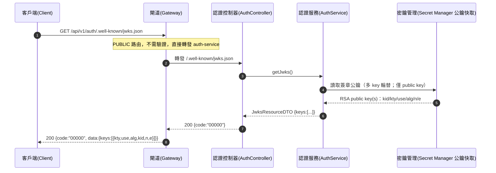

# auth-keys-001 GET /api/v1/auth/.well-known/jwks.json

取得驗證公鑰（JWKS，RFC 7517），**PUBLIC**（不需登入，`FR-GW-06`/AC-AUTH-008）。回傳 `keys` 陣列（`kty`/`use`/`alg`/`kid`/`n`/`e`），供 Gateway 與各服務**獨立驗證** JWT 簽章（ADR-009 defense in depth）。**僅公開 public key**；簽發 private key 存於 GCP Secret Manager（ADR-008），**無法經任何端點取得**（AC-AUTH-007）。支援多 key 輪替。

## 流程圖

## 邏輯

1. **讀取公鑰**：由簽發機密的公開部分（public key，多 key 輪替快取）組出 JWK 清單；**僅含 public key**，`n`/`e` 為 base64url 編碼的 RSA modulus/exponent。private key 存於 GCP Secret Manager（ADR-008），**任何端點皆無法取得**（AC-AUTH-007）。
2. **組裝 JWKS**：`keys` 陣列，每個 JWK 含：
   - `kty` = `"RSA"`；
   - `use` = `"sig"`（簽章用）；
   - `alg` = `"RS256"`；
   - `kid` = key id（驗證方依 JWT header `kid` 選鑰）；
   - `n` = modulus（base64url）；
   - `e` = public exponent（base64url，通常 `"AQAB"` = 65537）。
3. **回傳**：`200`，`data` 承載 `JwksResourceDTO { keys:[...] }`。**無 DB 讀寫**——公鑰來源為密鑰管理，不涉 `users`/`roles`/`user_roles`。

### 例外處理

| 情境 | 處置 | 錯誤碼 / HTTP |
|------|------|---------------|
| 讀取公鑰／組裝 JWKS 未預期例外 | 回系統錯誤 | `B0000` / 500 |

## 錯誤代碼清單

| 錯誤碼 | HTTP | 語意 | 觸發條件 |
|--------|------|------|----------|
| `00000` | 200 | 成功 | 回傳 JWKS `keys` 陣列 |
| `B0000` | 500 | 系統錯誤（一級） | 讀取公鑰／組裝 JWKS 未預期例外 |
