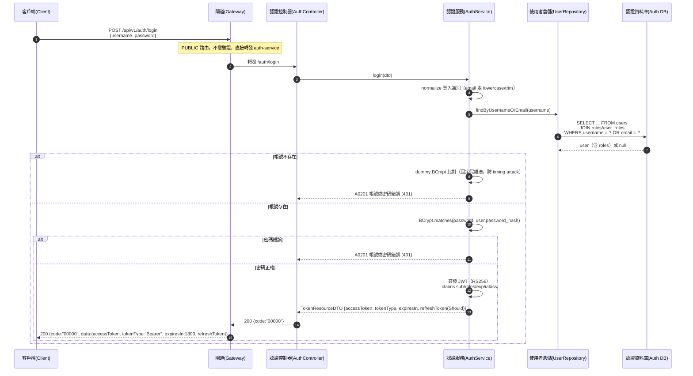

# auth-tokens-001 POST /api/v1/auth/login

登入並簽發身份憑證（UC-2），**PUBLIC**（不需登入）。依 `username`（可填 username **或 email**）查帳號 → 比對密碼 → 成功簽發 **JWT RS256** 身份憑證（claims `sub`/`roles`/`exp`/`iat`/`iss`）→ 回傳 `{ accessToken, tokenType, expiresIn, refreshToken(Should) }`。**帳號不存在與密碼錯誤回同一 `A0201`(401)**，不洩漏帳號存在性（AC-AUTH-006）。憑證承載內容全由伺服端決定，client 不得指定（AC-AUTH-011）。

## 流程圖

## 邏輯

登入前先做**結構性驗證**：`username` 與 `password` 皆必填且非空；缺欄位或空白 → `400`（`A0000`），不查帳號、不簽發憑證。

1. **normalize 登入識別**：`username` 欄位可填 username 或 email（SA UC-2）。對 email 做 lowercase + trim，與註冊 normalize 一致，確保唯一性查詢命中。
2. **查帳號**：`findByUsernameOrEmail` 以 `WHERE username = ? OR email = ?` 查 `users`，並 `JOIN` `roles`/`user_roles` 組出角色清單（`auth-db.md` §3.1 註記）。
3. **比對密碼**：`BCrypt.matches(password, user.password_hash)`。
   - **帳號不存在**：執行一次 **dummy BCrypt 比對**（對固定假雜湊），使耗時與存在帳號接近，避免 timing attack 洩漏存在性，然後回 `A0201`。
   - **密碼錯誤**：回 `A0201`——**與帳號不存在同碼同訊息**，不洩漏帳號存在性（AC-AUTH-006）。
4. **簽發 JWT**：比對成功 → 以 **RS256** 簽發 access token；private key 來自 GCP Secret Manager（ADR-008/009），header `kid` 對應 JWKS 公鑰。claims：
   - `sub` = `users.id`（身份）；
   - `roles` = 帳號角色清單（`["ROLE_USER"]` / `["ROLE_ADMIN"]`）；
   - `exp`/`iat` = 有效期／簽發時刻（伺服端計算，POC 短 TTL，`expiresIn` = 1800 秒）；
   - `iss` = auth-service 簽發者識別。
   - 上述承載內容**全由伺服端決定**，client 不得指定或影響（AC-AUTH-011）。
5. **組裝回應**：`200`，`data` 承載 `TokenResourceDTO`：`accessToken`（JWT）、`tokenType` = `"Bearer"`、`expiresIn` = 1800、`refreshToken`（**Should**，`FR-AUTH-04`，POC 未實作時可省略）。

### 例外處理

| 情境 | 處置 | 錯誤碼 / HTTP |
|------|------|---------------|
| username/password 缺欄位或空白 | 結構性驗證失敗，不查帳號 | `A0000` / 400 |
| 帳號不存在 | dummy 比對後回同一碼，不洩漏存在性 | `A0201` / 401 |
| 密碼錯誤 | 回同一碼，與帳號不存在不可區分 | `A0201` / 401 |
| 登入異常（二級通用碼） | 未細分的登入失敗 | `A0200` / 401 |
| 簽章／讀取機密／DB 查詢未預期例外 | 回系統錯誤，不簽發憑證 | `B0000` / 500 |

## 錯誤代碼清單

| 錯誤碼 | HTTP | 語意 | 觸發條件 |
|--------|------|------|----------|
| `00000` | 200 | 成功 | 正確 username/email + password 簽發身份憑證 |
| `A0000` | 400 | 用戶端錯誤（結構性） | username/password 缺欄位或空白 |
| `A0200` | 401 | 登入異常（二級，通用碼） | 未細分的登入失敗 |
| `A0201` | 401 | 帳號或密碼錯誤（與帳號不存在同碼，不洩漏存在性） | 帳號不存在或密碼錯誤 |
| `B0000` | 500 | 系統錯誤（一級） | 簽章／讀取機密／DB 查詢未預期例外 |

> 本端點無 `A0203`（憑證無效）——登入不驗證任何 incoming token；`A0203` 用於受保護 API 的 token 驗證（見 `auth-tokens-002`）。
