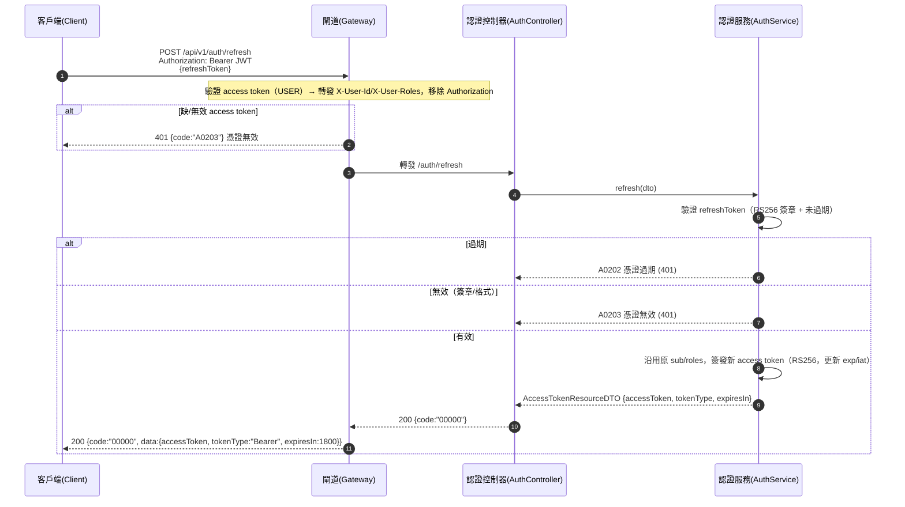

# auth-tokens-002 POST /api/v1/auth/refresh

刷新存取憑證（UC-3），**Should**（prod 前完成，非 POC 必須，`FR-AUTH-04`），端點標記 **USER**（需持有效憑證語境）。以 request body 的 `refreshToken` 換發新的 access token：**沿用原身份與角色，不變**（僅更新有效期）。刷新憑證過期 → `A0202`(401)，無效（簽章/格式）→ `A0203`(401)，使用者須重新登入（AC-AUTH-014）。

## 流程圖

## 邏輯

1. **前置（Gateway）**：驗證 access token（JWT RS256，`roles` 含 `ROLE_USER`）；缺/無效 → `401`（`A0203`）或權限不足 → `403`（`A0400`）。轉發時注入 `X-User-Id`/`X-User-Roles`，移除原始 `Authorization`（ADR-009）。`refreshToken` 由 request body 承載，不經此驗證。
2. **驗證 refreshToken**：以 public key（JWKS）驗證 RS256 簽章，並檢查 `exp` 未過期：
   - **過期** → `401` + `A0202`（AC-AUTH-014）。
   - **無效**（簽章/格式非法）→ `401` + `A0203`（AC-AUTH-014）。
3. **簽發新 access token**：從 refreshToken 解出原 `sub`（身份）與 `roles`（角色），**原樣沿用、不變更**，僅重新計算 `exp`/`iat`（更新有效期，`expiresIn` = 1800）並以 `iss` = auth-service 重新簽發（AC-AUTH-013）。**不查 DB**——身份/角色以原 refreshToken claims 為準。
4. **組裝回應**：`200`，`data` 承載 `AccessTokenResourceDTO { accessToken, tokenType, expiresIn }`；不回傳新的 refreshToken。

### 例外處理

| 情境 | 處置 | 錯誤碼 / HTTP |
|------|------|---------------|
| refreshToken 過期 | 拒絕，須重新登入 | `A0202` / 401 |
| refreshToken 無效（簽章/格式） | 拒絕，須重新登入 | `A0203` / 401 |
| 憑證異常（二級通用碼） | 未細分的憑證異常 | `A0200` / 401 |
| 未持有效憑證語境／越權 | 拒絕 | `A0400` / 403 |
| 簽章／讀取機密未預期例外 | 回系統錯誤 | `B0000` / 500 |

## 錯誤代碼清單

| 錯誤碼 | HTTP | 語意 | 觸發條件 |
|--------|------|------|----------|
| `00000` | 200 | 成功 | 有效 refreshToken 換發新 access token（身份/角色不變） |
| `A0200` | 401 | 登入異常（二級，通用碼） | 未細分的憑證異常 |
| `A0202` | 401 | 憑證過期 | refreshToken 已過期 |
| `A0203` | 401 | 憑證無效（簽章/格式）或缺憑證 | refreshToken 簽章/格式非法 |
| `A0400` | 403 | 權限不足 | 未持有效憑證語境／越權 |
| `B0000` | 500 | 系統錯誤（一級） | 簽章／讀取機密未預期例外 |
