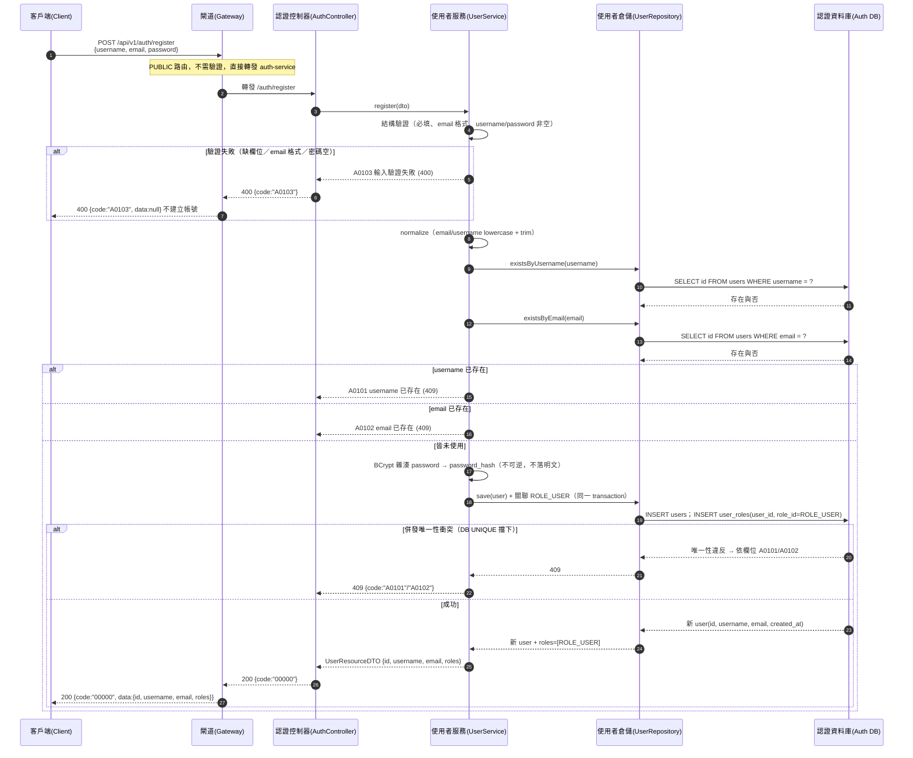

# auth-users-001 POST /api/v1/auth/register

使用者註冊（UC-1），**PUBLIC**（不需登入）。驗證輸入（username/email/password 非空、email 格式合法）→ 檢查 username/email 唯一性 → 以 **BCrypt 不可逆雜湊**密碼 → INSERT user 並預設角色 `ROLE_USER` → 回傳 `{ id, username, email, roles }`，**絕不含 `password` / `password_hash`**（`FR-AUTH-06`）。重複 username/email → `409`（`A0101`/`A0102`），輸入驗證失敗 → `400`（`A0103`）。

## 流程圖

## 邏輯

1. **結構驗證（400 層級）**：`username` / `email` / `password` 皆必填且非空（`minLength: 1`），`email` 須符合 email 格式（`format: email`）。任一不合法 → `400` + `A0103`，不建立帳號（AC-AUTH-003）。
2. **normalize**：對 `email`（及 `username`）做 lowercase + trim，避免 `Admin@x.com` 與 `admin@x.com` 因 DB `UNIQUE` 為 case-sensitive 而繞過唯一性（`auth-db.md` §3.2 註記）。
3. **唯一性檢查**：查 `users.username` 與 `users.email`；已存在 → `409`（username → `A0101`，email → `A0102`），不建立第二個帳號（AC-AUTH-002）。
4. **密碼雜湊**：以 **BCrypt** 對明文 password 產生 `password_hash`（`$2a$…`，60 chars，`VARCHAR(100)`）。明文僅存在於本次處理，**不落盤、不記錄、不回傳**（`FR-AUTH-06`）。
5. **建立帳號（transaction）**：`INSERT users` + `INSERT user_roles`（`role_id` = `ROLE_USER`）於**同一 transaction**，失敗即 rollback，**不留半完成資料**。併發下若 DB `UNIQUE`（`uq_users_username` / `uq_users_email`）擋下，依衝突欄位對映 `A0101` / `A0102`。
6. **組裝回應**：`200`，`data` 承載 `UserResourceDTO { id, username, email, roles }`，`roles` 為註冊預設 `["ROLE_USER"]`；使用者不得於註冊時指定或自選角色（AC-AUTH-001）。

### 例外處理

| 情境 | 處置 | 錯誤碼 / HTTP |
|------|------|---------------|
| 缺欄位／email 格式非法／密碼為空 | 拒絕，不建立帳號 | `A0103` / 400 |
| username 已存在 | 拒絕，不建立第二個帳號 | `A0101` / 409 |
| email 已存在 | 拒絕，不建立第二個帳號 | `A0102` / 409 |
| 註冊通用錯誤（二級碼） | 未細分的註冊失敗／衝突 | `A0100` / 400/409 |
| 雜湊／儲存／DB 未預期例外 | 回系統錯誤，rollback 不留部分帳號 | `B0000` / 500 |

## 錯誤代碼清單

| 錯誤碼 | HTTP | 語意 | 觸發條件 |
|--------|------|------|----------|
| `00000` | 200 | 成功 | 合法且唯一的 username/email/password 建立帳號 |
| `A0100` | 400/409 | 註冊錯誤（二級，通用碼） | 未細分的註冊失敗／衝突 |
| `A0101` | 409 | username 已存在 | username 唯一性衝突 |
| `A0102` | 409 | email 已存在 | email 唯一性衝突 |
| `A0103` | 400 | 註冊輸入驗證失敗 | 缺欄位／email 格式非法／密碼為空 |
| `B0000` | 500 | 系統錯誤（一級） | BCrypt 雜湊／DB 寫入未預期例外 |
