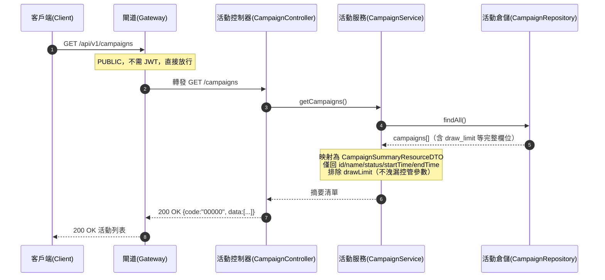

# campaign-campaigns-001 GET /api/v1/campaigns

活動列表（PUBLIC，不需登入）。回傳所有抽獎活動的摘要資訊，供前端展示可參與的活動。**不暴露管理欄位 `drawLimit`**（每使用者活動期間總抽獎次數上限屬營運控管參數）。POC 階段不分頁（活動數小），直接回傳全量（`docs/api/README.md` §2.8）。

## 流程圖

## 邏輯

1. **路由與放行**：Gateway 依路由表轉發至 campaign-service，本端點為 `PUBLIC`（`security: []`），不要求 JWT、不檢查角色。
2. **查詢活動**：`CampaignService` 呼叫 `CampaignRepository.findAll()` 讀取全量 `campaigns`（POC 不分頁；活動數小，直接全量回傳）。
3. **欄位映射（去敏）**：將每筆 `campaign` 映射為 `CampaignSummaryResourceDTO`，僅保留：
   - `id`、`name`、`status`、`startTime`、`endTime`；
   - **刻意排除 `drawLimit`**（SA §5.1 標記 internal、OpenAPI 契約明定列表不暴露管理欄位，避免洩漏控管參數）。
4. **排序**：預設依 `startTime`（或建立時間）排序；排序屬 SD 實作細節，契約不強制。
5. **組裝回應**：以統一 envelope `{ code, message, data }` 回傳，成功 `code = "00000"`、`message = "OK"`、`data` 為 `CampaignSummaryResourceDTO[]`。

### 例外處理

| 情境 | 處置 | 錯誤碼 / HTTP |
|------|------|---------------|
| 資料庫查詢拋出未預期例外 | 回傳系統錯誤，不洩漏內部細節 | `B0000` / 500 |

> 本端點為唯讀查詢，無使用者可觸發的用戶端錯誤路徑（`A0000` 等）；僅需處理系統錯誤。

## 錯誤代碼清單

| 錯誤碼 | HTTP | 語意 | 觸發條件 |
|--------|------|------|----------|
| `00000` | 200 | 成功 | 正常回傳活動列表 |
| `B0000` | 500 | 系統錯誤（一級） | 資料庫／內部未預期例外 |
