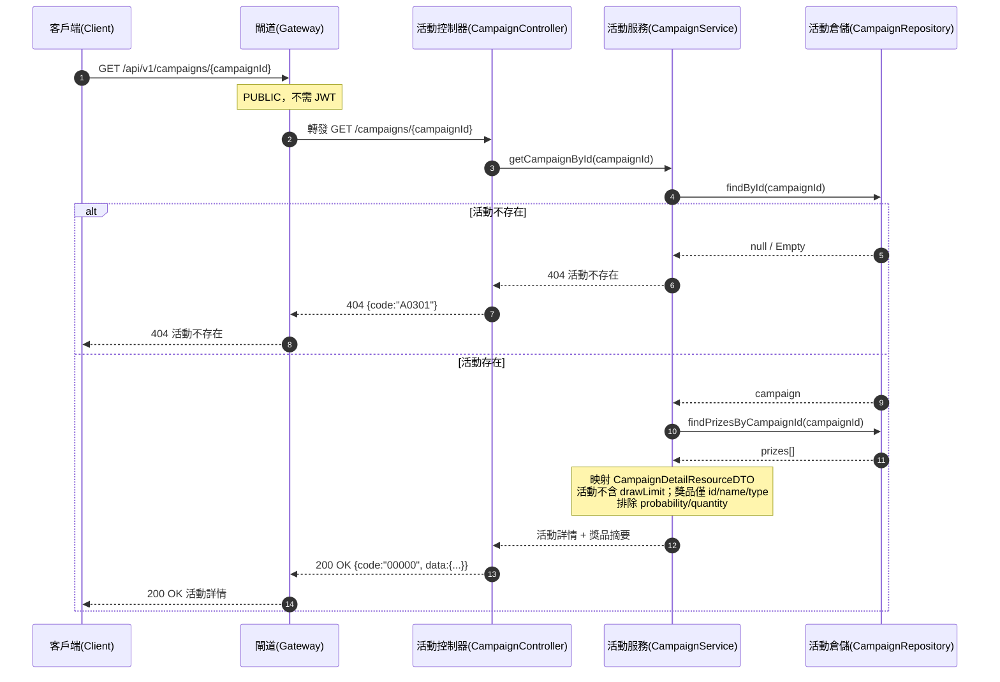

# campaign-campaigns-002 GET /api/v1/campaigns/{campaignId}

活動詳情（PUBLIC，不需登入）。回傳單一活動的基本資訊與獎品清單（供 client 抽獎前展示「可贏得什麼」）。與列表一致**不暴露 `drawLimit`**；獎品清單僅回 `id/name/type`，**不暴露 `probability`/`quantity`**（SA §5.2 敏感營運參數）。

## 流程圖

## 邏輯

1. **路由與放行**：Gateway 轉發，本端點 `PUBLIC`，不檢查身分。
2. **查詢活動**：`CampaignService` 依路徑參數 `campaignId` 查詢 `campaigns`。
   - 若不存在 → 回 `404` + `A0301`（活動不存在）。
3. **查詢獎品**：活動存在時，查詢該活動的獎品清單（依 `idx_prizes_campaign_sort(campaign_id, sort_order)` 固定順序）。
4. **欄位映射（去敏）**：
   - 活動欄位僅 `id/name/status/startTime/endTime`，**不暴露 `drawLimit`**。
   - 獎品欄位僅 `id/name/type`（`PrizeSummaryResourceDTO`），**不暴露 `probability`/`quantity`**（敏感營運參數，避免洩漏中獎率與庫存配置）。
5. **組裝回應**：統一 envelope，成功 `code = "00000"`，`data` 為 `CampaignDetailResourceDTO`（含 `prizes` 陣列）。

### 例外處理

| 情境 | 處置 | 錯誤碼 / HTTP |
|------|------|---------------|
| 活動不存在（`findById` 回空） | 回傳可理解的 404，不洩漏額外資訊 | `A0301` / 404 |
| 資料庫查詢拋出未預期例外 | 回傳系統錯誤 | `B0000` / 500 |

## 錯誤代碼清單

| 錯誤碼 | HTTP | 語意 | 觸發條件 |
|--------|------|------|----------|
| `00000` | 200 | 成功 | 正常回傳活動詳情 |
| `A0301` | 404 | 活動不存在 | `campaignId` 無對應活動 |
| `B0000` | 500 | 系統錯誤（一級） | 資料庫／內部未預期例外 |
