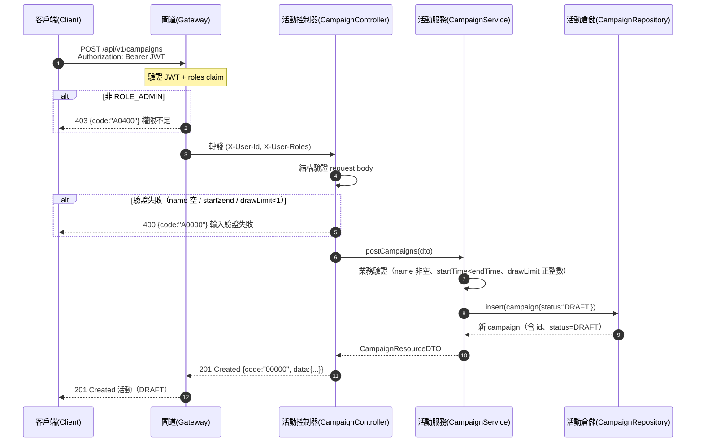

# campaign-campaigns-003 POST /api/v1/campaigns

建立抽獎活動（UC-1），**需 `ROLE_ADMIN`**。建立後初始狀態固定為 `DRAFT`（尚不可被 USER 抽獎，AC-CAMP-005）。成功回 **201 Created**。`id`/`status` 由伺服端產生，client 不得指定。

## 流程圖

## 邏輯

1. **身分驗證與授權**：Gateway 驗證 JWT（RS256）並以 `roles` claim 判定；非 `ROLE_ADMIN` → 回 `403` + `A0400`。
2. **結構驗證（400 層級）**：請求體須含 `name`、`startTime`、`endTime`、`drawLimit` 四必填欄位，型別／格式錯誤 → `400` + `A0000`。
3. **業務驗證（`A0000`）**：
   - `name` 非空（`minLength: 1`，`maxLength: 128`）；
   - `startTime < endTime`（`chk_campaigns_time` 同義驗證，於 app 層先做）；
   - `drawLimit` 為正整數 ≥ 1（`chk_campaigns_draw_limit` 同義驗證）。
   - 任一失敗 → 回 `400` + `A0000`，**不建立活動**。
4. **落庫**：`CampaignService` 組裝實體並 `insert`：
   - `status` 由伺服端**固定為 `DRAFT`**（client 不得指定，即使傳入亦忽略）；
   - `id` 由 `BIGSERIAL` 產生；
   - `created_at`/`updated_at` 由 app 層維護（`@LastModifiedDate`）。
5. **組裝回應**：回 **201 Created**，`data` 為 `CampaignResourceDTO`（**含 `drawLimit`**，管理端回傳完整欄位），`status = "DRAFT"`。

### 例外處理

| 情境 | 處置 | 錯誤碼 / HTTP |
|------|------|---------------|
| 非 `ROLE_ADMIN` 呼叫 | 拒絕，不進入業務邏輯 | `A0400` / 403 |
| `name` 空白／缺必填欄位／型別錯誤 | 拒絕，不建立活動 | `A0000` / 400 |
| `startTime ≥ endTime` | 拒絕，不建立活動 | `A0000` / 400 |
| `drawLimit < 1`（非正整數） | 拒絕，不建立活動 | `A0000` / 400 |
| 資料庫寫入未預期例外 | 回系統錯誤，不留半完成資料（單筆 INSERT 原子） | `B0000` / 500 |

## 錯誤代碼清單

| 錯誤碼 | HTTP | 語意 | 觸發條件 |
|--------|------|------|----------|
| `00000` | 201 | 成功（建立） | 合法輸入成功建立活動（DRAFT） |
| `A0000` | 400 | 用戶端錯誤（一級，結構性／驗證） | 名稱空、時間先後非法、`drawLimit` 非正整數 |
| `A0400` | 403 | 權限不足 | 非 `ROLE_ADMIN` 越權存取管理功能 |
| `B0000` | 500 | 系統錯誤（一級） | 資料庫寫入未預期例外 |
