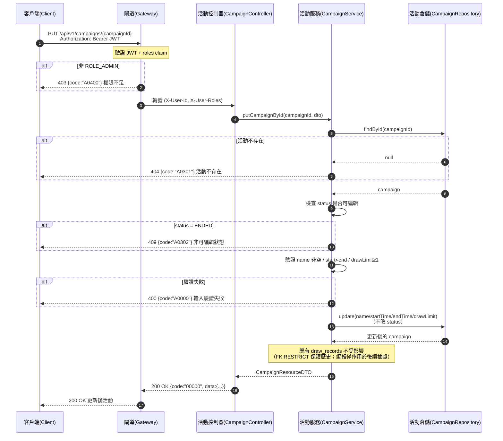

# campaign-campaigns-004 PUT /api/v1/campaigns/{campaignId}

全量更新活動可編輯欄位（UC-1），**需 `ROLE_ADMIN`**。`PUT` 覆蓋 `name/startTime/endTime/drawLimit`，**不改 `status`**（狀態轉移走 PATCH status）。僅可於**可編輯狀態**（`DRAFT` 全量、`ACTIVE` 動態修改）進行；`ENDED` 終態不可編輯。**編輯只影響後續抽獎，不回溯既有抽獎結果。**

## 流程圖

## 邏輯

1. **身分驗證與授權**：Gateway 驗證 JWT + `roles`；非 `ROLE_ADMIN` → `403` + `A0400`。
2. **存在性檢查**：`findById(campaignId)`；不存在 → `404` + `A0301`。
3. **可編輯狀態檢查（`A0302`）**：
   - `DRAFT` → 允許全量修改；
   - `ACTIVE` → 允許動態修改（後續抽獎生效）；
   - `ENDED` → 終態，**不可編輯**，回 `409` + `A0302`，狀態與資料不變。
4. **輸入驗證（`A0000`）**：`name` 非空、`startTime < endTime`、`drawLimit` 正整數 ≥ 1；任一失敗 → `400` + `A0000`，不寫庫。
5. **更新**：僅覆蓋 `name/startTime/endTime/drawLimit` 四欄，**不修改 `status`**。`updated_at` 由 app 層刷新。
6. **不回溯語意**：既有 `draw_records` 以 FK `ON DELETE RESTRICT` 保護，本次更新不改寫任何已產生結果；僅影響後續抽獎（`FR-CAMP-11`、SA UC-1）。
7. **組裝回應**：回 `200`，`data` 為更新後的 `CampaignResourceDTO`（含 `drawLimit`）。

### 例外處理

| 情境 | 處置 | 錯誤碼 / HTTP |
|------|------|---------------|
| 非 `ROLE_ADMIN` | 拒絕 | `A0400` / 403 |
| 活動不存在 | 404 | `A0301` / 404 |
| 活動 `ENDED`（不可編輯） | 409，不變更任何欄位 | `A0302` / 409 |
| 輸入驗證失敗（name 空／時間非法／drawLimit 非法） | 400，不寫庫 | `A0000` / 400 |
| 資料庫寫入未預期例外 | 系統錯誤 | `B0000` / 500 |

## 錯誤代碼清單

| 錯誤碼 | HTTP | 語意 | 觸發條件 |
|--------|------|------|----------|
| `00000` | 200 | 成功 | 合法更新成功 |
| `A0301` | 404 | 活動不存在 | `campaignId` 無對應活動 |
| `A0302` | 409 | 活動狀態衝突（非可編輯狀態） | 活動 `ENDED` |
| `A0000` | 400 | 用戶端錯誤（結構性／驗證） | 名稱空、時間先後非法、`drawLimit` 非法 |
| `A0400` | 403 | 權限不足 | 非 `ROLE_ADMIN` |
| `B0000` | 500 | 系統錯誤（一級） | 資料庫寫入未預期例外 |
