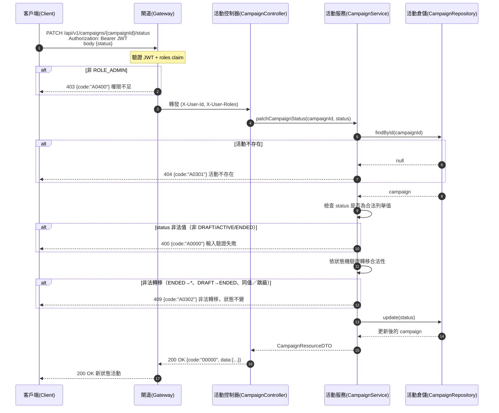

# campaign-campaigns-005 PATCH /api/v1/campaigns/{campaignId}/status

觸發活動狀態轉移（UC-3），**需 `ROLE_ADMIN`**。請求體 `{ "status": "..." }`。合法轉移 `DRAFT → ACTIVE → ENDED`（單向），`ENDED` 為終態不可回轉。非法轉移 → `409`（`A0302`），狀態不變。僅 `ACTIVE` 狀態的活動可供 USER 抽獎（AC-CAMP-005）。

## 流程圖

## 邏輯

1. **身分驗證與授權**：Gateway 驗證 JWT + `roles`；非 `ROLE_ADMIN` → `403` + `A0400`。僅 ADMIN 可變更狀態（SA §4.3）。
2. **存在性檢查**：`findById(campaignId)`；不存在 → `404` + `A0301`。
3. **請求體合法性（`A0000`）**：`status` 必須是 `CampaignStatus` 列舉值（`DRAFT`/`ACTIVE`/`ENDED`）之一；非法值 → `400` + `A0000`。
4. **狀態機轉移驗證（`A0302`）**：依下表判定，非法轉移回 `409` + `A0302`，**狀態不變**：

   | 現行狀態 | 目標狀態 | 允許 |
   |----------|----------|------|
   | `DRAFT` | `ACTIVE` | ✅ 單向，啟用後不可退回草稿 |
   | `ACTIVE` | `ENDED` | ✅ 手動結束或到達 `end_time` |
   | `ENDED` | 任何 | ❌ 終態，不可回轉 |
   | `DRAFT` | `ENDED` | ❌ 跳級 |
   | 任意 | 同值 | ❌ 無意義轉移 |

5. **更新**：合法轉移 → 寫入新 `status`，`updated_at` 刷新。
6. **組裝回應**：回 `200`，`data` 為轉移後的 `CampaignResourceDTO`（含新 `status`）。

### 例外處理

| 情境 | 處置 | 錯誤碼 / HTTP |
|------|------|---------------|
| 非 `ROLE_ADMIN` | 拒絕 | `A0400` / 403 |
| 活動不存在 | 404 | `A0301` / 404 |
| `status` 非法值（非列舉） | 400，狀態不變 | `A0000` / 400 |
| 非法轉移（ENDED→*、跳級、同值） | 409，狀態不變 | `A0302` / 409 |
| 資料庫寫入未預期例外 | 系統錯誤 | `B0000` / 500 |

## 錯誤代碼清單

| 錯誤碼 | HTTP | 語意 | 觸發條件 |
|--------|------|------|----------|
| `00000` | 200 | 成功 | 合法狀態轉移成功 |
| `A0301` | 404 | 活動不存在 | `campaignId` 無對應活動 |
| `A0302` | 409 | 活動狀態衝突（非法轉移） | `ENDED` 後再啟用、跳級、同值轉移 |
| `A0000` | 400 | 用戶端錯誤（結構性／驗證） | 請求體 `status` 非法值 |
| `A0400` | 403 | 權限不足 | 非 `ROLE_ADMIN` |
| `B0000` | 500 | 系統錯誤（一級） | 資料庫寫入未預期例外 |
