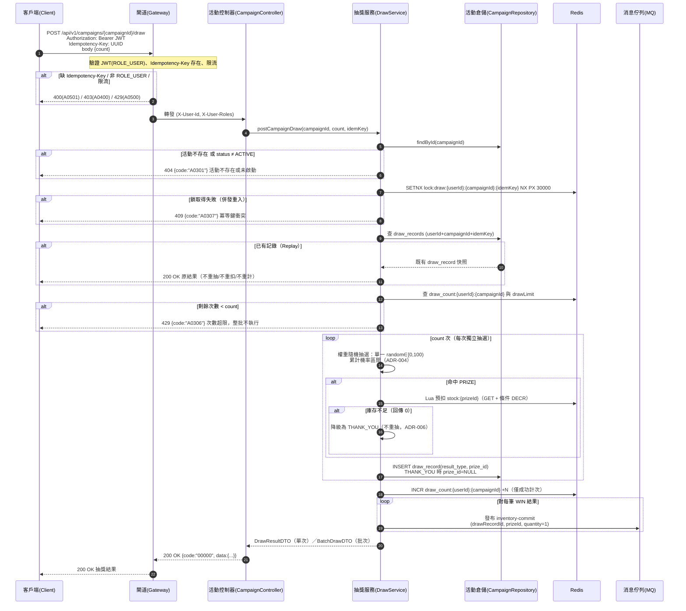

# campaign-draws-001 POST /api/v1/campaigns/{campaignId}/draw

執行抽獎（UC-4 單次、UC-5 批次），**需 `ROLE_USER`**，**必須帶 `Idempotency-Key: <UUID>` header**（ADR-005）。`request body { count }`，`count=1` 單次、`count=N≥2` 批次（整批由單一冪等鍵保護）。中獎結果由伺服端權重隨機演算法決定（ADR-004）。防重複抽獎（冪等 + replay，ADR-005）與防超抽（庫存確認 + 降級，ADR-006）。

## 流程圖

## 邏輯

### 前置（Gateway）

- 驗證 JWT 且 `roles` 含 `ROLE_USER`；非 `ROLE_USER` → `403`（`A0400`）。
- 檢查 `Idempotency-Key` header 存在；缺 → `400`（`A0501`，gateway 層，ADR-005）。
- 限流（per-user / per-IP）；超限 → `429`（`A0500`，與業務次數超限 `A0306` 不同維度）。
- 轉發時注入 `X-User-Id`、`X-User-Roles`；`userId` 由憑證決定（不信任 client）。

### 主流程（DrawService）

1. **活動 ACTIVE 檢查**：`findById(campaignId)`；不存在或 `status ≠ ACTIVE`（`DRAFT`/`ENDED`）→ `404` + `A0301`（AC-CAMP-005）。
2. **冪等鎖（ADR-005 第一線）**：`SETNX lock:draw:{userId}:{campaignId}:{idemKey} NX PX 30000`。
   - 取得失敗 → 併發重入，回 `409` + `A0307`。
3. **Replay 查詢**：以複合鍵 `userId + campaignId + idempotencyKey` 查 `draw_records`。
   - 已有記錄 → 回傳既有結果快照（`200`，逐位元一致），**不重抽、不重扣庫存、不重扣次數**（AC-CAMP-012/013）。
4. **個人次數檢查（`A0306`）**：以 `drawLimit`（活動期間總額）與 `draw_count:{userId}:{campaignId}` 計算剩餘次數。
   - `count > 剩餘次數` → `429` + `A0306`；**批次不足整批不執行**（不產生部分結果，AC-CAMP-006/007/010）。
5. **權重隨機抽選（ADR-004）**：讀取活動獎品（固定 `sort_order` 順序），對每次抽選產生單一 `random ∈ [0,100)`，走累計機率區間命中獎品。批次 `count=N` 執行 N 次獨立抽選。
6. **庫存確認與降級（ADR-006）**：命中 `PRIZE` → 以 Redis Lua 原子預扣 `stock:{prizeId}`（`GET` + 條件 `DECR`）。
   - 回傳 0（庫存不足）→ **降級為 THANK_YOU，不重抽**（AC-CAMP-014）；本次仍計次。
7. **記錄 draw_records（ADR-005 第二線 DB UNIQUE）**：INSERT 每筆結果：
   - `result_type` = `WIN` / `THANK_YOU`；
   - `prize_id`：`WIN` → 中獎獎品 id；`THANK_YOU` → **NULL**（DB §3.3）；
   - `idempotency_key` 落複合 UNIQUE 鍵。撞 UNIQUE → 轉 replay 查表回傳（理論上已被鎖擋）。
8. **計次（ADR-003）**：`INCR draw_count:{userId}:{campaignId}` 一次 `+N`（僅成功產生結果的請求計次；replay/超限不計）。TTL 對齊活動 `end_time`。
9. **發布 `inventory-commit`（ADR-007）**：對每筆 `WIN` 結果發布事件 `(drawRecordId, prizeId, quantity=1)`；`THANK_YOU`（含降級）不發布。`drawRecordId` 為下游冪等鍵（ADR-006）。事件異步投遞，campaign 不等待 inventory 扣減。
10. **組裝回應**：`count=1` 回單一 `DrawResultResourceDTO`；`count≥2` 回 `BatchDrawResourceDTO`（`{draws:[...]}`）。`THANK_YOU` 結果 `prize = null`。

### 例外處理

| 情境 | 處置 | 錯誤碼 / HTTP |
|------|------|---------------|
| 非 `ROLE_USER` | 拒絕 | `A0400` / 403 |
| 缺 `Idempotency-Key` header | Gateway 攔截 | `A0501` / 400 |
| 活動不存在或非 `ACTIVE` | 404，不抽 | `A0301` / 404 |
| 併發重入（鎖被他人持有） | 409，回請以同 key 重試 | `A0307` / 409 |
| 個人次數超限（活動總額）／批次不足 | 429，不抽不扣任何資源 | `A0306` / 429 |
| `count < 1`（結構性） | 400 | `A0000` / 400 |
| 命中獎品但庫存不足 | 降級 THANK_YOU，不重抽，計次 | 200（非錯誤） |
| 資料庫寫入／Redis／事件發布未預期例外 | 系統錯誤（事件需 at-least-once 重試） | `B0000` / 500 |

## 錯誤代碼清單

| 錯誤碼 | HTTP | 語意 | 觸發條件 |
|--------|------|------|----------|
| `00000` | 200 | 成功（首次與 replay 皆 200，body 逐位元一致） | 抽獎成功／replay 回原結果 |
| `A0301` | 404 | 活動不存在，或非 ACTIVE 之抽獎請求 | `DRAFT`/`ENDED` 或無此活動 |
| `A0306` | 429 | 個人抽獎次數超限（活動期間總額） | 剩餘次數 < `count` |
| `A0307` | 409 | 冪等鍵衝突（併發重入） | Redis 鎖被他人持有 |
| `A0400` | 403 | 權限不足 | 非 `ROLE_USER` |
| `A0000` | 400 | 用戶端錯誤（結構性） | `count < 1` 等輸入錯誤 |
| `A0501` | 400 | 抽獎請求缺 `Idempotency-Key` header（gateway 前置） | 缺 header |
| `B0000` | 500 | 系統錯誤（一級） | Redis／DB／事件發布未預期例外 |

> `A0500`（gateway 限流）與 `A0501`（缺 Idempotency-Key）由 Gateway 前置處理，非 campaign-service 產生，列於此僅供完整追蹤；campaign-service 自身產生的錯誤碼為 `A0301`/`A0306`/`A0307`/`A0000`/`A0400`/`B0000`。
