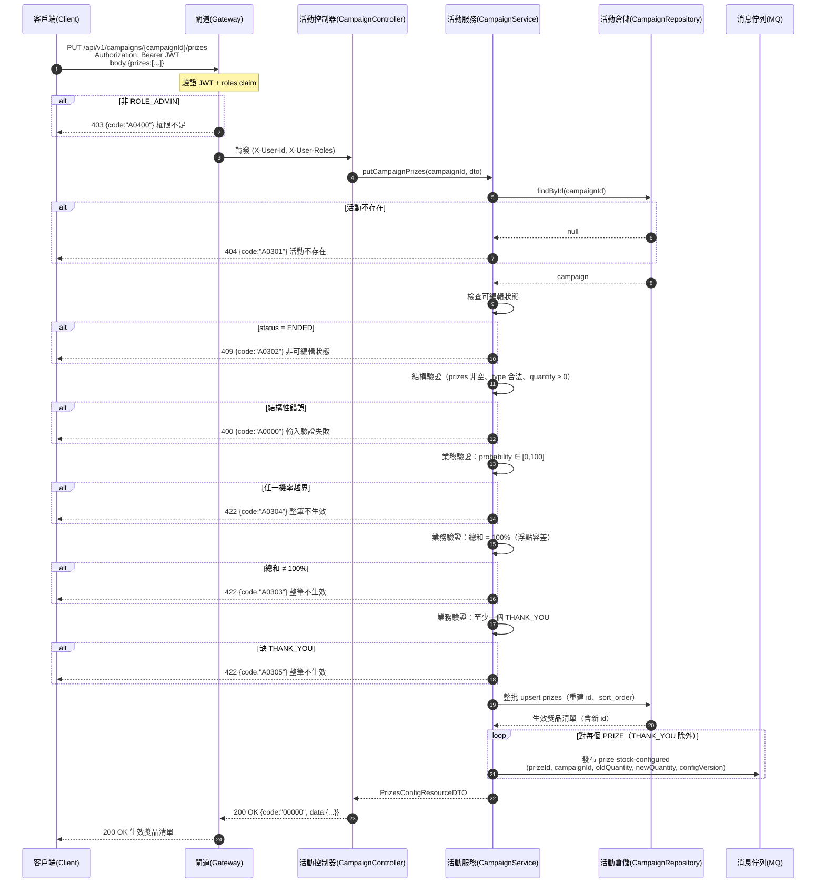

# campaign-prizes-001 PUT /api/v1/campaigns/{campaignId}/prizes

整批覆蓋配置獎品與機率（UC-2），**需 `ROLE_ADMIN`**。請求體為完整獎品清單（含銘謝惠顧）。驗證（總和 = 100%、機率越界、缺 THANK_YOU）任一失敗 → 整筆配置**不生效**（`422`）。成功即 upsert 獎品並發布 `prize-stock-configured`（ADR-010），回傳帶系統產生的 `id`。

## 流程圖

## 邏輯

1. **身分驗證與授權**：Gateway 驗證 JWT + `roles`；非 `ROLE_ADMIN` → `403` + `A0400`。
2. **存在性檢查**：`findById(campaignId)`；不存在 → `404` + `A0301`。
3. **可編輯狀態檢查（`A0302`）**：`ENDED` 不可編輯配置 → `409` + `A0302`。
4. **結構驗證（`A0000`）**：`prizes` 陣列非空（`minItems: 1`）、每項 `name` 非空、`type` ∈ `{PRIZE, THANK_YOU}`、`quantity` ≥ 0（負數 → 400）。結構性錯誤 → `400` + `A0000`。
5. **業務不變量驗證（依序，任一失敗 → `422`，整筆不生效）**：
   - **機率範圍（`A0304`）**：每個 `probability ∈ [0, 100]`；越界 → `422`。
   - **總和 = 100%（`A0303`）**：所有獎品（**含 THANK_YOU**）`probability` 總和與 100.0 的差值在浮點容差內（ADR-004，如 `abs(sum-100) ≤ 1e-6`）；不等 → `422`。
   - **至少一個 THANK_YOU（`A0305`）**：缺 `type = THANK_YOU` → `422`。
   - 上述任一失敗 → **整筆配置不生效**，活動維持原有效配置（AC-CAMP-001~003）。
6. **整批覆蓋 upsert**：驗證通過後，於交易內整批重建該活動獎品（`sort_order` 依請求順序重編，`id` 由系統重建）；`THANK_YOU` 的 `quantity` 忽略（無限庫存，落庫 0）。既有抽獎結果不受影響（僅後續抽獎採用新配置）。
7. **發布 `prize-stock-configured`（ADR-010）**：對每個 `PRIZE`（`THANK_YOU` 不發布）發布事件，payload 含 `prizeId`（冪等鍵）、`campaignId`、`oldQuantity`、`newQuantity`、`configVersion`（每獎品單調遞增）。`oldQuantity` 於更新交易內原子取得（config 真相）。
8. **組裝回應**：回 `200`，`data` 為 `PrizesConfigResourceDTO`（`campaignId` + 生效獎品清單，含系統產生的 `id`、`probability`、`quantity`）。

### 例外處理

| 情境 | 處置 | 錯誤碼 / HTTP |
|------|------|---------------|
| 非 `ROLE_ADMIN` | 拒絕 | `A0400` / 403 |
| 活動不存在 | 404 | `A0301` / 404 |
| 活動 `ENDED`（不可編輯配置） | 409 | `A0302` / 409 |
| 結構性錯誤（缺 prizes／type 非法／quantity 負） | 400 | `A0000` / 400 |
| 機率總和 ≠ 100% | 422，整筆不生效 | `A0303` / 422 |
| 機率越界 `[0,100]` | 422，整筆不生效 | `A0304` / 422 |
| 缺 `THANK_YOU` 獎品 | 422，整筆不生效 | `A0305` / 422 |
| 資料庫寫入／事件發布未預期例外 | 系統錯誤（config 已持久化但事件需重試） | `B0000` / 500 |

## 錯誤代碼清單

| 錯誤碼 | HTTP | 語意 | 觸發條件 |
|--------|------|------|----------|
| `00000` | 200 | 成功 | 合法配置生效並回傳獎品清單 |
| `A0301` | 404 | 活動不存在 | `campaignId` 無對應活動 |
| `A0302` | 409 | 活動狀態衝突（非可編輯狀態） | 活動 `ENDED` |
| `A0303` | 422 | 獎品機率總和 ≠ 100% | 全體（含 THANK_YOU）機率總和超出浮點容差 |
| `A0304` | 422 | 獎品機率越界 `[0,100]` | 任一獎品 `probability` 越界 |
| `A0305` | 422 | 缺 `THANK_YOU` 獎品 | 配置中無 `type = THANK_YOU` |
| `A0000` | 400 | 用戶端錯誤（結構性） | 缺 `prizes`／`type` 非法／`quantity` 為負 |
| `A0400` | 403 | 權限不足 | 非 `ROLE_ADMIN` |
| `B0000` | 500 | 系統錯誤（一級） | 資料庫寫入／事件發布未預期例外 |
