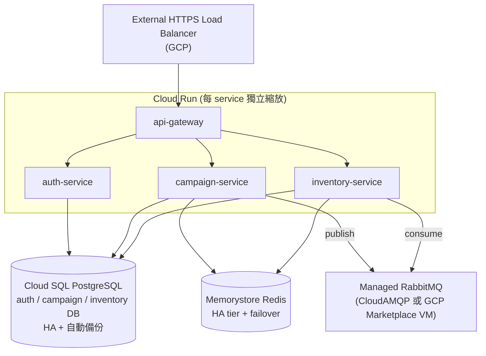

# 部署文件 (Deployment)

> 本文說明 lucky-draw-system 的地端（docker-compose）與 prod（GCP Cloud Run）部署拓撲、設定檔 / Secrets 管理，以及「go prod」路徑。對應 ADR-008（部署）、ADR-007（broker）。

## 1. Prod 拓撲 (GCP Cloud Run)



### 1.1 元件對照

| 元件 | 規格建議 (POC 起步) | prod 注意事項 |
|------|---------------------|---------------|
| Cloud Run service ×4 | CPU 1 / Memory 512MiB–1GiB，min-instances 0–1 | 抽獎活動期間：campaign/inventory 調高 min-instances（避免 cold start）與 max-instances |
| Cloud SQL | 單 instance 3 個 database（auth/campaign/inventory），或分 2–3 instance | 開啟 HA（regional failover replica）+ PITR 自動備份；後期可把 inventory DB 獨立 instance |
| Memorystore | 基礎 tier（讀取 replica 選配） | 開 HA tier；monitor memory，設定 `noeviction` |
| RabbitMQ | CloudAMQP 單節點（POC）或 Marketplace VM | 需求成長：cluster 化 或 切換 Spring Cloud Stream binder 至 Kafka / Pub/Sub（config-only，見 ADR-007） |

### 1.2 CI / CD 流程（建議）

```text
Push to main
  → GitHub Actions / Cloud Build
      → ./gradlew build (unit + integration test)
      → 各 service 打 image（Gradle bootJar + Jib → Artifact Registry, tag = git SHA）
      → gcloud run deploy <service> --image=... --revision-suffix=<SHA>
      → 健康檢查通過後切流量；失敗自動 rollback 前一 revision
```

## 2. 地端開發環境 (docker-compose)

### 2.1 檔案位置

統一放在 **`docker/docker-compose.yml`**（與 README 的專案結構一致）。

### 2.2 內容草稿

```yaml
services:
  postgres:
    image: postgres:16-alpine
    container_name: ld-postgres
    environment:
      POSTGRES_USER: lucky
      POSTGRES_PASSWORD: lucky_dev
      POSTGRES_DB: lucky_draw
    ports: ["5432:5432"]
    volumes: [postgres_data:/var/lib/postgresql/data]

  redis:
    image: redis:7-alpine
    container_name: ld-redis
    command: ["redis-server", "--appendonly", "yes"]
    ports: ["6379:6379"]
    volumes: [redis_data:/data]

  rabbitmq:
    image: rabbitmq:3-management-alpine
    container_name: ld-rabbitmq
    environment:
      RABBITMQ_DEFAULT_USER: lucky
      RABBITMQ_DEFAULT_PASS: lucky_dev
    ports:
      - "5672:5672"   # AMQP
      - "15672:15672" # Management UI

volumes:
  postgres_data:
  redis_data:
```

### 2.3 啟動方式

```bash
cp .env.example .env
docker-compose -f docker/docker-compose.yml up -d
./gradlew :services:api-gateway:bootRun        # 依序啟動各 service
./gradlew :services:auth-service:bootRun
./gradlew :services:campaign-service:bootRun
./gradlew :services:inventory-service:bootRun
```

### 2.4 Spring Profiles 對應

| Profile | DB | Redis | Broker |
|---------|-----|-------|--------|
| `dev-sqlite` | SQLite（免 Docker） | docker-compose | docker-compose |
| `dev`（預設） | PostgreSQL（docker-compose） | docker-compose | docker-compose |
| `prod` | Cloud SQL | Memorystore | Managed RabbitMQ |

## 3. 環境變數與 Secrets

### 3.1 `.env.example`（repo root）

```bash
# --- Spring Profiles ---
SPRING_PROFILES_ACTIVE=dev

# --- PostgreSQL (dev: docker-compose / prod: Cloud SQL) ---
DB_AUTH_URL=jdbc:postgresql://localhost:5432/auth_db
DB_CAMPAIGN_URL=jdbc:postgresql://localhost:5432/campaign_db
DB_INVENTORY_URL=jdbc:postgresql://localhost:5432/inventory_db
DB_USERNAME=lucky
DB_PASSWORD=lucky_dev

# --- Redis (dev: docker-compose / prod: Memorystore) ---
REDIS_HOST=localhost
REDIS_PORT=6379
REDIS_PASSWORD=

# --- RabbitMQ (dev: docker-compose / prod: managed) ---
RABBITMQ_HOST=localhost
RABBITMQ_PORT=5672
RABBITMQ_USERNAME=lucky
RABBITMQ_PASSWORD=lucky_dev

# --- JWT (RS256) ---
JWT_PRIVATE_KEY_PATH=file:./secrets/private.pem   # 僅 auth-service
JWT_PUBLIC_KEY_PATH=file:./secrets/public.pem     # 各 service 共用
JWT_EXPIRATION_MINUTES=60

# --- 活動風控預設值 ---
DRAW_RATE_LIMIT_PER_MINUTE=30
```

> `.env` 加入 `.gitignore`；`.env.example` 提交。

### 3.2 prod 的 Secrets 管理

| 機密 | 存放位置 | 使用方式 |
|------|----------|----------|
| DB password | GCP Secret Manager | Cloud Run secret ref 掛載為 env var |
| Redis password | GCP Secret Manager | 同上 |
| RabbitMQ 密碼 | GCP Secret Manager | 同上 |
| **JWT private key** | GCP Secret Manager（**僅 auth-service** 有權限讀） | auth-service 啟動時載入 |
| JWT public key | Cloud Run env var / `file:` 掛載，或透過 auth-service 的 public endpoint | 各 service 定期 fetch 並快取（JWKS 輪替） |

原則：

- **非敏感**設定（DB 名稱、profile、限流閾值）直接放 Cloud Run env var，方便調整。
- **敏感**值一律 Secret Manager；`gcloud` IAM 最小權限（per-service service account）。

## 4. 「Go Prod」路徑 (Path to Production)

從 POC（本機 + docker-compose）推進到 prod 的檢查清單與演化順序：

| 步驟 | 動作 | 對應決策 |
|------|------|----------|
| 1 | 基礎設施起 Cloud SQL（HA）+ Memorystore（HA）+ 受管 RabbitMQ | ADR-008 |
| 2 | 各 service image 化（Jib），CI 自動 build + push Artifact Registry | ADR-001 / 008 |
| 3 | Cloud Run 部署 + service account 最小權限 + Secret Manager 接線 | ADR-008 |
| 4 | **DB 併發語意驗證**：以 Testcontainers/PostgreSQL 重跑風控 integration test（SQLite 語意 ≠ PostgreSQL，ADR-002 已知風險） | ADR-002 / 006 |
| 5 | 抽獎活動演練：min-instances、max-instances、Memorystore 容量、broker backlog 監控 | ADR-003 / 008 |
| 6 | 對帳 job 上線（Redis ↔ DB 校正，見 risk-control.md §5.3） | ADR-006 |
| 7 | 流量成長：campaign/inventory 各別放大；**broker 換 binder（RabbitMQ → Kafka / Pub/Sub）為 config-only change** | ADR-007 |
| 8 | 長期演化：OAuth2/OIDC（ADR-009）、JWT blacklist、動態即時機率（ADR-004） | ADR-009 / 004 |

### 4.1 上線前必測場景（Checklist）

- [ ] 併發 100 同請求（同 Idempotency-Key）→ 只有 1 次抽獎，其餘 replay / 409。
- [ ] 庫存 = 1 時，併發 100 次抽獎 → 至多 1 個實體獎品出獎，其餘皆銘謝惠顧。
- [ ] inventory-commit 重複投遞 → DB 不重複扣。
- [ ] Redis 當機重啟 → 對帳 job 以 DB 重建 counter，不超抽。
- [ ] 活動機率總和 ≠ 100% 的配置 → 配置 API 拒絕（400/422）。
- [ ] 高 QPS 壓測：確認 Gateway 限流先擋住，campaign/inventory 的 Cloud Run 正常縮放。
