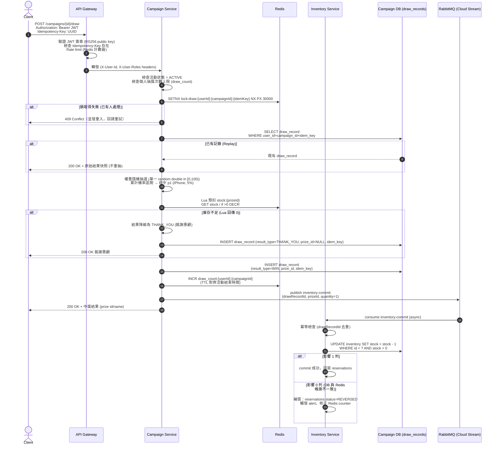
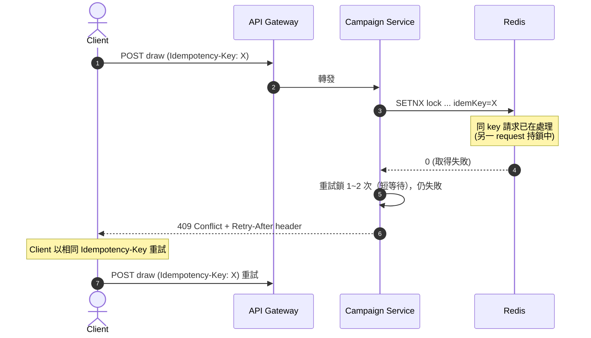
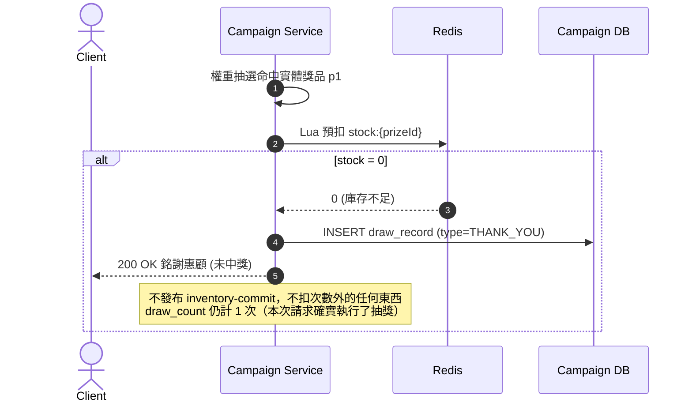
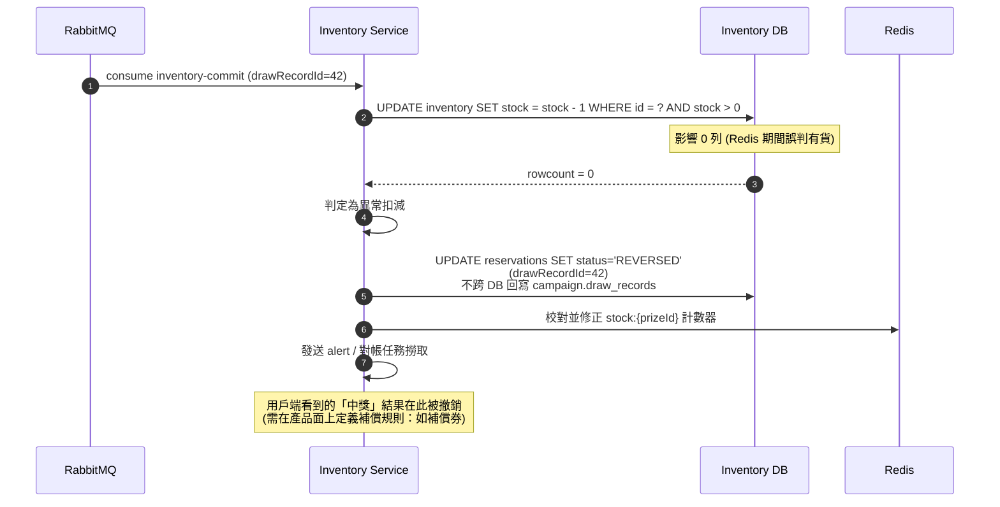

# 抽獎完整流程 (Draw Flow)

> 本文描述一次抽獎請求從 Client 到最終結果的**完整生命週期**，包含正常路徑與所有失敗路徑。相關決策：ADR-003（Redis 併發）、ADR-004（權重抽獎）、ADR-005（冪等）、ADR-006（防超抽）、ADR-007（消息）、ADR-009（安全）。

## 1. 正常路徑 (Happy Path) — 抽中實體獎品

### 正常路徑步驟摘要

| Step | 負責者 | 動作 | 關鍵機制 |
|------|--------|------|----------|
| 1–4 | Gateway | JWT 驗證、Idempotency-Key 檢查、限流、路由 | ADR-009、ADR-005 |
| 5 | Campaign | 活動啟用 + 個人次數上限檢查 | `draw_count` Redis counter |
| 6 | Campaign+Redis | 冪等鎖 SETNX (TTL 30s) | ADR-005 |
| 7–9 | Campaign | replay 檢查（撞 UNIQUE 或鎖過期後查表） | ADR-005 |
| 10 | Campaign | 權重隨機抽選（O(n) 累計區間） | ADR-004 |
| 11 | Campaign+Redis | 熱點庫存 Lua 原子預扣 | ADR-003 / 006 |
| 12–13 | Campaign+DB | 落庫 draw_record（含 idempotency_key UNIQUE） | ADR-005 |
| 14 | Campaign+Redis | 抽獎次數 INCR（僅成功請求計次） | ADR-003 |
| 15–17 | Campaign→MQ | 發布 inventory-commit，立即回 client | ADR-007 |
| 18–21 | Inventory | 異步條件更新 DB（source of truth）+ 補償 | ADR-006 |

## 2. 失敗路徑 (Failure Paths)

### Path A — 鎖競爭 / 鎖等待逾時

- **行為**：並發的相同請求回 `409 Conflict`；Client 應以**相同 Idempotency-Key** 重試。
- **防護**：若鎖因 TTL 過期 / 執行者當機而消失，DB 的 UNIQUE constraint 仍是最終防線（重試會走 replay 路徑）。

### Path B — 庫存不足 → 降級銘謝惠顧

- **語意**：中獎機率是「配置機率」，庫存不足時**不重抽**，直接降級為銘謝惠顧。這是刻意設計——避免「抽中後庫存不足再重抽」造成機率被機率地改寫與營運上的不公平感。

### Path C — DB 條件更新 0 列 → 補償

- **成因**：Redis 與 DB 之間的 eventual consistency 時間窗（見 risk-control.md §5），或 Redis 資料遺失後重建期間。
- **處理原則**：**DB 為真相**——DB 說沒有就是沒有；回滾中獎結果 + 修正 Redis + alert。

### Path D — 其他失敗（活動結束 / 次數用罄 / Token 無效）

| 情境 | 偵測點 | 回應 | 說明 |
|------|--------|------|------|
| Token 過期 / 簽章無效 | Gateway | `401 Unauthorized` | ADR-009 |
| 非 ADMIN 呼叫 admin API | Gateway / Service | `403 Forbidden` | ADR-009 |
| 缺少 Idempotency-Key | Gateway | `400 Bad Request` | ADR-005 |
| 活動不存在 / 未啟動 / 已結束 | Campaign | `404` / `409` | 活動狀態檢查 |
| 活動期間抽獎次數已達上限 | Campaign | `429 Too Many Requests` | `draw_count` counter |
| RabbitMQ 暫時不可用 | Campaign publish | 重試 / dead-letter | inventory-commit 最終仍會送出（broker 恢復後） |

## 3. 時序與一致性承諾 (Timing & Consistency Semantics)

| 面向 | 承諾 |
|------|------|
| Client 收到中獎結果的時間 | 僅依賴 Redis 預扣 + Campaign DB 落庫（快速路徑），**不等待** Inventory DB 條件更新 |
| Inventory DB 最終狀態 | 透過 inventory-commit 異步達成，**eventual consistency** |
| 重複請求結果 | 與第一次完全一致（replay），**絕不重抽** |
| 實體獎品出貨數 | **絕不超過 DB 庫存**（條件更新保證），Redis 預扣只是加速層 |
