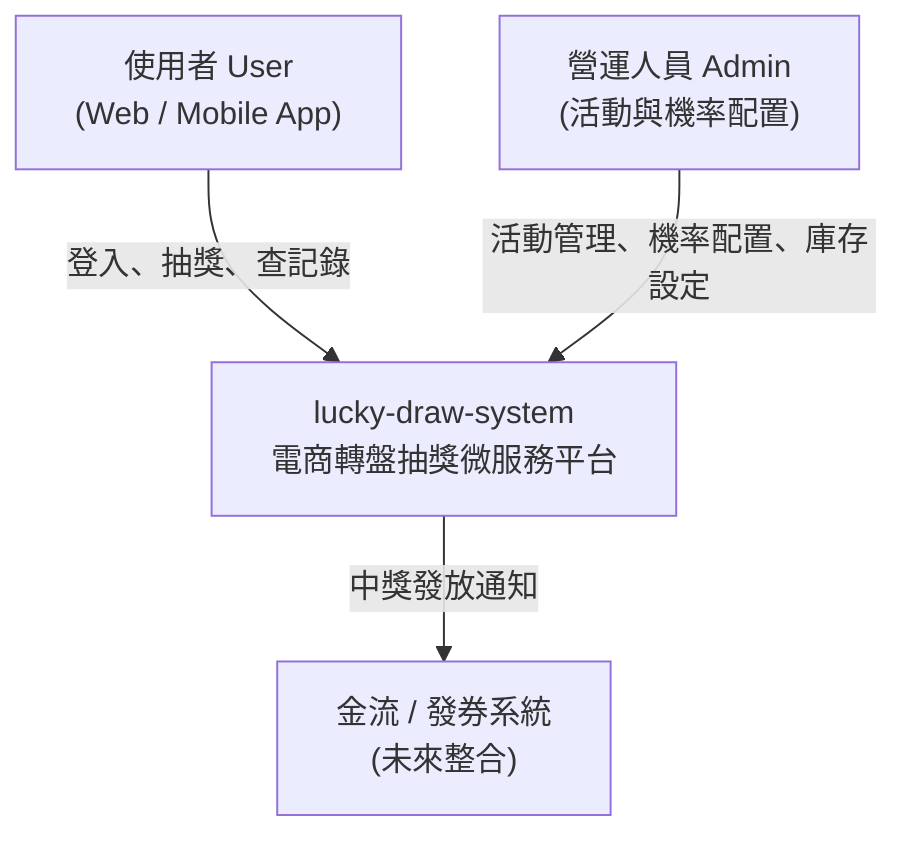
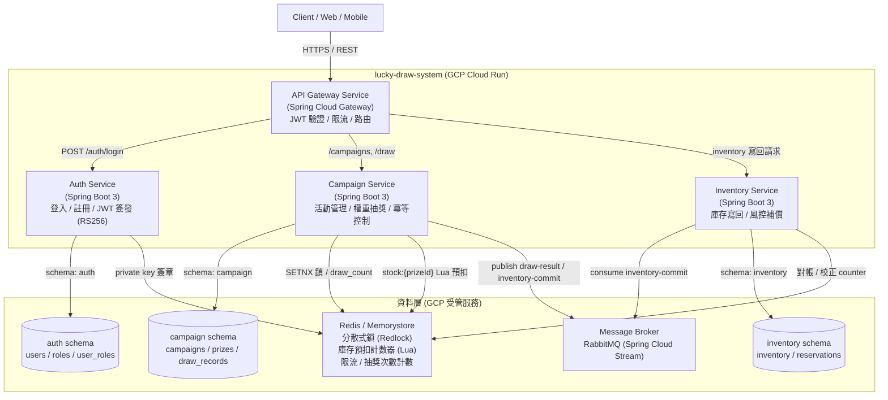

# 系統架構總覽 (System Architecture Overview)

> 本文為 lucky-draw-system 的架構總覽，包含 C4 層級的 Context / Container 圖、服務職責對照與技術棧矩陣。個別決策的來龍去脈請見 [ADR 索引](../adr/README.md)。

## 1. C4 — Context 圖 (系統脈絡)

**外部參與者：**

- **使用者 (User)**：登入 / 註冊、抽獎、查詢個人抽獎記錄。
- **營運人員 (Admin)**：建立活動、配置獎品機率（含銘謝惠顧，總和 = 100%）、設定庫存。
- **金流 / 發券系統**：中獎後串接發放（本階段為未來整合項目）。

## 2. C4 — Container 圖 (容器視圖)

從 [README 的架構圖](../README.md) 擴充：加入 Redis、消息佇列（RabbitMQ）與各 service 的資料庫。

**Container 元件對照表（對應 README 的 4 個模組）：**

| Container | 對應 README 模組 | 職責 | 關鍵技術 |
|-----------|------------------|------|----------|
| API Gateway Service | 1. API Gateway | 統一 Entry point、JWT 驗證、Rate Limiting、API 路由、Idempotency-Key 檢查 | Spring Cloud Gateway, Spring Security, Redis 限流 |
| Auth Service | 2. Auth Service | 使用者身份驗證與權限管理、JWT (RS256) 簽發、public key 公開 | Spring Security, JWT, PostgreSQL |
| Draw Campaign Service | 3. Draw Campaign Service | 活動管理、動態獎品機率配置（含銘謝惠顧）、權重抽獎邏輯、防重複抽獎、個人次數上限、Redis 預扣、發布事件 | Spring Boot 3, Redis Lua, Spring Cloud Stream |
| Inventory Service | 4. Inventory Service | 庫存條件更新（source of truth）、inventory-commit 消費、計數器校正、補償對帳 | Spring Boot 3, PostgreSQL, Redis |

## 3. 技術棧矩陣 (Tech Stack Matrix)

| 層級 | 技術 | 版本 / 規格 | 用途 | 對應 ADR |
|------|------|-------------|------|----------|
| 語言 | Java | 21 (LTS) | 所有 service 與 common | — |
| 框架 | Spring Boot | 3.x | 應用程式框架 | ADR-001 |
| 建置 | Gradle | 8.x (Wrapper) | 多模組建置 | ADR-001 |
| API 層 | Spring Cloud Gateway | 對應 Spring Boot 3.x | 閘道、路由、限流 | ADR-009 |
| 安全 | Spring Security + JWT | RS256 非對稱簽章 | 鑑別與授權 | ADR-009 |
| DB (prod) | PostgreSQL | 於 GCP Cloud SQL | 每服務自有 schema（auth / campaign / inventory） | ADR-002 |
| DB (dev) | SQLite / H2 | Spring Profiles 切換 | 地端輕量開發 | ADR-002 |
| 快取 / 併發 | Redis | Memorystore (prod) / Docker (dev) | Redlock、Lua 預扣、計數器 | ADR-003 |
| 消息 | Spring Cloud Stream + RabbitMQ binder | docker-compose (dev) / managed (prod) | draw-result、inventory-commit | ADR-007 |
| 部署 | Docker / Cloud Run | docker-compose (dev) / GCP (prod) | 容器化與部署 | ADR-008 |
| 文件 / 測試 | OpenAPI 3.0, JUnit 5, Mockito, Testcontainers | 隨專案套件管理 | API 文件與測試 | — |

## 4. 關鍵架構特性 (Key Architectural Characteristics)

1. **服務資料所有權隔離**（ADR-002 / 008）：每服務只讀寫自有 schema（role 權限強制），跨服務一律走 API/event；實體部署（單/多 instance、schema 或 database）為 infra 細節，隨環境可調。
2. **抽獎路徑為「Redis 加速 + DB 真相」兩層**（ADR-003 / 006）：低延遲 + 最終一致性，DB 條件更新保證不超抽。
3. **冪等性由 Client 協作**（ADR-005）：Idempotency-Key + Redis 鎖 + DB UNIQUE 三道防線。
4. **Broker 抽象化**（ADR-007）：Spring Cloud Stream 讓 POC 用 RabbitMQ、prod 可 config-only 換 Kafka / Pub/Sub。
5. **Defense in Depth**（ADR-009）：Gateway 統一驗證 + 各 service 獨立複驗 JWT。

## 5. 非功能性需求對照

| 需求 | 對應設計 |
|------|----------|
| 高可用 (HA) | Cloud Run 多 instance、Cloud SQL / Memorystore HA、broker 受管（ADR-008） |
| 高併發 | Redis 原子預扣 + Lua（ADR-003 / 006）、限流（Gateway + 次數計數） |
| 一致性 | DB 條件更新為真相、Redis 為加速層、對帳補償收斂（ADR-006） |
| 可擴展 | 各 service 獨立縮放、Gradle 多模組獨立建置（ADR-001 / 008） |
| 可觀察性 | 各 service 標準 logging + broker backlog 監控（部署文件補充） |
