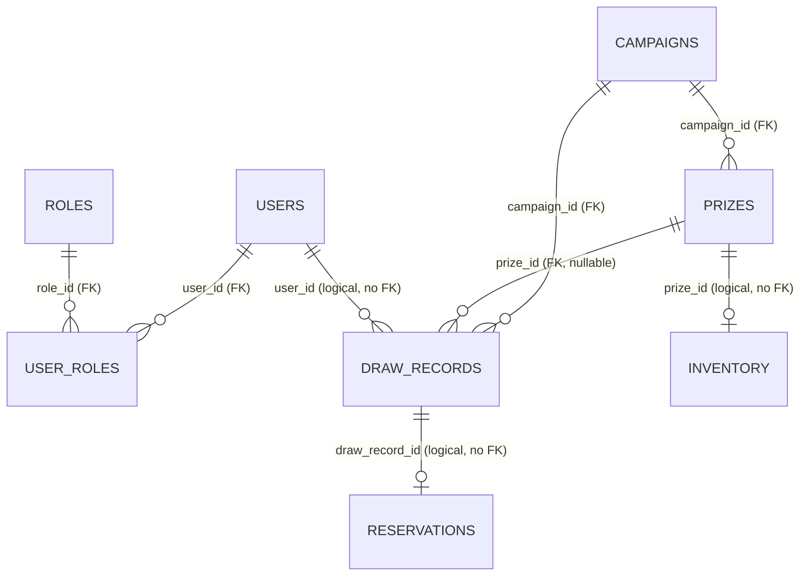

# 資料庫設計 (Database Design)

## 1. 文件資訊

| 項目 | 內容 |
|------|------|
| **狀態 (Status)** | Proposed |
| **日期 (Date)** | 2026-08-14 |
| **角色 (Layer)** | SD — Technical Design（資料表、型別、constraint、index、FK、migration） |
| **範圍** | Auth DB / Campaign DB / Inventory DB 三套獨立資料庫的 DDL、DML、ER |

### 關聯文件 (Related Documents)

| 文件 | 說明 |
|------|------|
| [ADR-002](../adr/002-database-per-service.md) | Database-Per-Service、table 所有權、dev SQLite/H2 vs prod PostgreSQL |
| [ADR-005](../adr/005-anti-double-draw-idempotency.md) | 複合冪等鍵 `UNIQUE(user_id, campaign_id, idempotency_key)` |
| [ADR-006](../adr/006-anti-overselling.md) | 條件更新 `UPDATE ... WHERE stock > 0`、補償、對帳 |
| [auth-service SA](../specs/auth-service/README.md) | 業務資料字典（§5.1 users） |
| [campaign-service SA](../specs/campaign-service/README.md) | 業務資料字典（§5.1~5.3） |
| [inventory-service SA](../specs/inventory-service/README.md) | 業務資料字典（§5.1~5.2） |
| [requirements](../specs/requirements.md) | FR / NFR（本文件對齊 `NFR-04`、`FR-CAMP-04/06` 等） |

> **層級界線**：本文件定義**技術資料字典**（型別、constraint、index、FK）。欄位的**業務語意**見各 SA 文件的 Business Data Dictionary（§5），本文件不重述，僅以「SA 欄位 → 欄位」映射表連結。

---

## 2. 文件索引 (Index)

| 資料庫 | 文件 | 核心 Table |
|--------|------|-----------|
| Auth DB | [auth-db.md](auth-db.md) | `users`、`roles`、`user_roles` |
| Campaign DB | [campaign-db.md](campaign-db.md) | `campaigns`、`prizes`、`draw_records` |
| Inventory DB | [inventory-db.md](inventory-db.md) | `inventory`、`reservations` |
| 種子資料 | [dml-seed.md](dml-seed.md) | ADMIN 帳號、ROLE_USER/ROLE_ADMIN、範例活動與獎品（機率總和 = 100%） |

---

## 3. Database-Per-Service 總覽 (Rationale Summary)

依 [ADR-002](../adr/002-database-per-service.md)：**每個 service 擁有並只操作自己的資料庫，禁止跨 service 直接存取他人 DB**。三個資料域（auth / campaign / inventory）的查詢模式與擴展需求不同，獨立 DB 讓 schema、index、連線池、擴展規格各自調校，故障互相隔離。

| Service | DB | 核心 Table | 熱點特性 |
|---------|-----|-----------|---------|
| auth-service | Auth DB | `users`、`roles`、`user_roles` | 中頻 OLTP，讀多寫少 |
| campaign-service | Campaign DB | `campaigns`、`prizes`、`draw_records` | 中頻讀 + **高頻寫**（`draw_records` insert 熱點） |
| inventory-service | Inventory DB | `inventory`、`reservations` | 中頻寫（async batch，見 ADR-006），真相來源 |

### 3.1 跨服務資料交換（無跨 DB FK）

跨服務資料交換一律透過 **API 呼叫或 Kafka event**（ADR-002 / ADR-007）。因此：

- **跨 DB 之間沒有 FK**。`prize_id`、`draw_record_id`、`user_id` 在非屬主 DB 中是**邏輯引用（logical reference）**，其值由事件/API 攜帶，不做外鍵約束。
- 這表示**沒有跨 DB 的 transaction**；一致性由 event + 補償（compensation）+ 對帳（reconciliation）達成最終一致（ADR-006）。

### 3.2 邏輯引用對照表 (Logical Reference Map)

| 引用欄位（所在 DB） | 指向（屬主 DB） | 攜帶方式 | 冪等/唯一約束 |
|---------------------|-----------------|----------|---------------|
| `draw_records.user_id` | `auth.users.id` | Gateway 傳遞之 JWT `sub`（ADR-009） | 無（稽核欄位） |
| `inventory.prize_id` | `campaign.prizes.id` | 獎品配置同步（初始庫存） | `UNIQUE` |
| `reservations.prize_id` | `campaign.prizes.id` | `inventory-commit` event payload（ADR-007） | 無（索引加速對帳） |
| `reservations.draw_record_id` | `campaign.draw_records.id` | `inventory-commit` event payload（ADR-007） | `UNIQUE`（冪等，ADR-005/006） |

---

## 4. 全域設計決策 (Cross-cutting Design Decisions)

### 4.1 Primary Key 型別：`BIGSERIAL`（BIGINT）

全系統所有實體 PK 統一採用 **`BIGSERIAL`（PostgreSQL 自增 BIGINT）**，理由：

1. **跨服務引用不需跨 DB 序列協調**：`prize_id` / `draw_record_id` / `user_id` 由屬主 DB 的序列產生一次，再以「值」隨 event/API 傳遞（ADR-007），下游只是存值，不需協調 ID。
2. **索引友善**：遞增 BIGINT 避免 B-tree page split / index fragmentation，對 `draw_records`（抽獎高峰高頻 insert）尤其重要。
3. **可讀性與稽核**：數字 ID 對營運對帳、客服稽核（`draw_record_id`）、種子資料而言可讀性遠勝 UUID。
4. **儲存緊湊**：8 bytes vs UUID 16 bytes，索引更小。
5. **dev profile 相容**：SQLite / H2 對 BIGINT 自增有原生支援，不需額外 UUID 處理。

> **UUID 替代方案（prod 演化保留）**：若未來需要「ID 不可列舉（防猜測獎品/活動 ID）」或「分散式無協調 ID 產生」，可將 PK 遷移為 UUID（v7），需另立 migration 並同步改動跨服務引用型別。POC 階段不採用。
>
> **唯一例外**：`draw_records.idempotency_key` 是 client 提供的 **UUID**（ADR-005），本質是冪等識別而非實體 ID，保留 UUID 型態（`VARCHAR(36)`）。

### 4.2 狀態列：`VARCHAR` + `CHECK`（不用 PostgreSQL `ENUM`）

`status` / `type` / `result_type` 等有限值集合欄位統一採 **`VARCHAR(n)` + `CHECK` constraint**，而非 PostgreSQL 原生 `ENUM`：

- SQLite / H2（dev profile）**不支援** PostgreSQL 原生 `ENUM`；用 `VARCHAR + CHECK` 三者皆可執行，DDL 可近似共用。
- PostgreSQL `ALTER TYPE ... ADD VALUE` 在舊版本無法在同一個 transaction 內使用、且降序移除值困難；`VARCHAR + CHECK` 的演進成本較低（改 CHECK 即可）。
- 合法值集合的**業務語意**（`DRAFT/ACTIVE/ENDED` 等）見各 SA 文件，本層以 CHECK 固化。

### 4.3 時間型別：`TIMESTAMPTZ`

prod（PostgreSQL）一律使用 **`TIMESTAMPTZ`**（含時區），統一以 **UTC** 儲存/比較。`end_time` 是個人抽獎次數計數（`draw_count`）TTL 的對齊邊界（campaign-service SA UC-1）。

### 4.4 無法用 DB CHECK 表達的跨列/跨表規則

| 規則 | 來源 | 為何不能/不宜用 DB 表達 | 落實位置 |
|------|------|--------------------------|---------|
| 獎品機率總和 = 100%（含 THANK_YOU） | `FR-CAMP-04` | 跨 row 加總無法用 CHECK 表達（需 aggregate + 跨 row 比較） | **app-level validation**（campaign-service 配置時驗證，浮點容差內） |
| 至少一個 `type = THANK_YOU` | `FR-CAMP-06` | 跨 row 存在性檢查 | app-level validation |
| 單一機率 ∈ `[0,100]` | `FR-CAMP-06` | 單列可表達 → 以 `CHECK` 固化（見 campaign-db.md） | DB CHECK + app 驗證雙保險 |

---

## 5. 型別對照表 (Type Mapping: prod vs dev)

| 語意 | PostgreSQL (prod) | SQLite (dev) | H2 (dev) | 備註 |
|------|-------------------|--------------|----------|------|
| 自增 PK | `BIGSERIAL` | `INTEGER PRIMARY KEY AUTOINCREMENT` | `BIGINT AUTO_INCREMENT` | 見 §4.1 |
| 整數 | `BIGINT` / `INT` | `INTEGER` | `BIGINT` / `INT` | SQLite 單一 INTEGER 動態寬度 |
| 可變字串 | `VARCHAR(n)` | `TEXT`（**不強制長度**） | `VARCHAR(n)` | 長度上限僅 prod 強制 |
| UUID / 冪等鍵 | `VARCHAR(36)` | `TEXT` | `VARCHAR(36)` | 存 UUID 字串 |
| 機率（十進位） | `NUMERIC(5,2)` | `NUMERIC`（近似 REAL） | `NUMERIC(5,2)` | dev 浮點誤差需留意 |
| 時間戳（含時區） | `TIMESTAMPTZ` | `TEXT`（ISO-8601，無時區型別） | `TIMESTAMP WITH TIME ZONE` | 統一存 UTC |
| 布林 | `BOOLEAN` | `INTEGER` (0/1) | `BOOLEAN` | 本專案暫未使用 |
| `ENUM` | （不用） | （不支援） | （不支援） | 見 §4.2，改 `VARCHAR+CHECK` |
| 條件更新 `WHERE stock > 0` | **原生支援，row lock 正確** | 語法支援但並發語意不同 | 語法支援但並發語意不同 | **併發測試須以 PG 驗證**（ADR-002） |

> ⚠️ **dev 語意警示**（ADR-002 後果）：SQLite/H2 對 `UPDATE ... WHERE stock > 0` 的**行鎖與並發寫入行為**與 PostgreSQL 不同。防超抽的正確性測試（`FR-INV-02`）必須在 prod 前以 **PostgreSQL（docker-compose / Testcontainers）** 驗證，不能只靠 dev profile。

---

## 6. Migration 說明 (Schema Migration)

- **三套獨立 migration**（對應三個 DB），各自隨所屬 service 管理（ADR-002 後果）。
- **建議 Flyway**（Spring Boot 預設整合），每 service 各自 `src/main/resources/db/migration/`，以版本化 SQL 對應本文件的 DDL/DML：
  - `V1__init_auth.sql` / `V2__seed_auth.sql`
  - `V1__init_campaign.sql` / `V2__seed_campaign.sql`
  - `V1__init_inventory.sql`（inventory 初始值由 campaign 配置同步而來，見 dml-seed.md）
- **Flyway DB 支援**：PostgreSQL 需 `flyway-database-postgresql`；H2 內建支援；SQLite 需 `flyway-database-sqlite`（community）。
- **替代方案 Liquibase**：若偏好 changelog（XML/YAML/SQL）與 rollback 管理，可用 Liquibase 取代；本文件以 Flyway 為預設（與 Spring Boot 原生整合度最高）。
- dev / prod 切換由 **Spring Profiles** 控制（ADR-002）：`application-dev.yml`（SQLite/H2）vs `application-prod.yml`（PostgreSQL，GCP Cloud SQL）。

---

## 7. ER 總覽 (Overview ER Diagram)

> 關聯線上的標註為判斷依據：標 `FK` = 同 DB 內實際外鍵；標 **`logical`** = 跨 DB 邏輯引用，**無 FK**（ADR-002）。Mermaid `erDiagram` 不區分線型，故以標籤標明。

### 各 DB 的 ER 圖

- Auth DB → [auth-db.md](auth-db.md)
- Campaign DB → [campaign-db.md](campaign-db.md)
- Inventory DB → [inventory-db.md](inventory-db.md)
