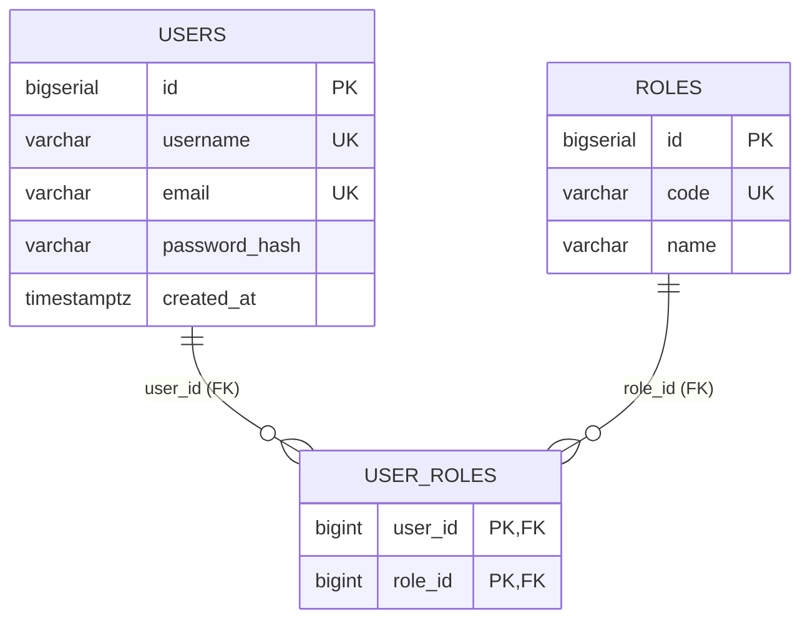

# Auth DB — 資料庫設計 (Database Design)

## 1. 文件資訊

| 項目 | 內容 |
|------|------|
| **狀態 (Status)** | Proposed |
| **日期 (Date)** | 2026-08-14 |
| **角色 (Layer)** | SD — Technical Design |
| **服務** | auth-service（使用者註冊/登入、JWT 簽發、權限分級） |
| **業務語意來源** | [auth-service SA](../specs/auth-service/README.md) §5.1 |

> **層級界線**：本文件定義技術型別、constraint、index。業務語意（欄位意義、合法值、敏感性）見 SA 文件，此處僅以「SA 欄位 → 欄位」映射表連結，不重述。

---

## 2. Table 總覽

| Table | 用途 | 對應 SA 語意 |
|-------|------|-------------|
| `users` | 使用者帳號 | SA §5.1 users |
| `roles` | 角色（`ROLE_USER` / `ROLE_ADMIN`） | SA §5.1 `roles`（歸一化） |
| `user_roles` | 使用者-角色多對多關聯 | SA §5.1 `roles`（歸一化） |

---

## 3. DDL（PostgreSQL — prod 真相）

```sql
-- =============================================================
-- Auth DB — PostgreSQL DDL
-- Service: auth-service   (ADR-002 schema-per-service)
-- 密碼安全: FR-AUTH-06 (不可逆雜湊)  權限分級: FR-AUTH-05
-- =============================================================

-- -------------------------------------------------------------
-- users：使用者帳號
-- 密碼以 BCrypt 雜湊儲存，任何環節不得明文 (FR-AUTH-06)
-- -------------------------------------------------------------
CREATE TABLE users (
    id            BIGSERIAL    PRIMARY KEY,
    username      VARCHAR(64)  NOT NULL,
    email         VARCHAR(255) NOT NULL,
    password_hash VARCHAR(100) NOT NULL,   -- BCrypt $2a$… (60 chars)，絕非明文
    created_at    TIMESTAMPTZ  NOT NULL DEFAULT now(),

    CONSTRAINT uq_users_username UNIQUE (username),
    CONSTRAINT uq_users_email    UNIQUE (email)
);

COMMENT ON TABLE  users             IS '使用者帳號（Auth DB 屬主）';
COMMENT ON COLUMN users.id           IS '使用者唯一識別（PK，BIGSERIAL）；對應 JWT sub claim';
COMMENT ON COLUMN users.username     IS '登入帳號名，全系統唯一';
COMMENT ON COLUMN users.email        IS '電子郵件，全系統唯一';
COMMENT ON COLUMN users.password_hash IS 'BCrypt 不可逆雜湊（60 chars），從不進入 request/response';
COMMENT ON COLUMN users.created_at   IS '建立時間（UTC）';

-- -------------------------------------------------------------
-- roles：角色（兩級權限分級，FR-AUTH-05）
-- -------------------------------------------------------------
CREATE TABLE roles (
    id   BIGSERIAL   PRIMARY KEY,
    code VARCHAR(32) NOT NULL,   -- 'ROLE_USER' / 'ROLE_ADMIN'
    name VARCHAR(64) NOT NULL,   -- 顯示名稱

    CONSTRAINT uq_roles_code UNIQUE (code)
);

COMMENT ON TABLE  roles       IS '角色（ROLE_USER / ROLE_ADMIN），授權判定之依據';
COMMENT ON COLUMN roles.code  IS '角色代碼，唯一（Spring Security hasRole 使用）';
COMMENT ON COLUMN roles.name  IS '角色顯示名稱';

-- -------------------------------------------------------------
-- user_roles：使用者-角色關聯（多對多）
-- PK(user_id, role_id) 同時防止重複授予同一角色
-- -------------------------------------------------------------
CREATE TABLE user_roles (
    user_id BIGINT NOT NULL REFERENCES users(id) ON DELETE CASCADE,
    role_id BIGINT NOT NULL REFERENCES roles(id) ON DELETE CASCADE,

    PRIMARY KEY (user_id, role_id)
);

COMMENT ON TABLE user_roles IS '使用者-角色關聯（註冊預設 ROLE_USER，見 SA UC-1/UC-4）';

-- 反向查詢：依角色找使用者（授權盤點/稽核）
CREATE INDEX idx_user_roles_role_id ON user_roles (role_id);
```

### 3.1 Technical Data Dictionary（SA 欄位 → 欄位）

| SA 欄位 | DB 欄位 | 型別 | Nullable | Constraint | Index |
|---------|---------|------|----------|------------|-------|
| `id` | `users.id` | `BIGSERIAL` | No | PK | PK（cluster） |
| `username` | `users.username` | `VARCHAR(64)` | No | `UNIQUE`, NOT NULL | `uq_users_username` |
| `email` | `users.email` | `VARCHAR(255)` | No | `UNIQUE`, NOT NULL | `uq_users_email` |
| `password_hash` | `users.password_hash` | `VARCHAR(100)` | No | NOT NULL（存 BCrypt） | — |
| `roles`（業務欄位） | 歸一化為 `roles` + `user_roles` | — | — | 見下 | — |
| —（roles 歸一化） | `roles.code` / `roles.name` | `VARCHAR(32)`/`VARCHAR(64)` | No | `UNIQUE(code)` | `uq_roles_code` |
| —（roles 歸一化） | `user_roles.user_id` / `role_id` | `BIGINT` | No | PK(user_id, role_id) + FK | PK（前綴 user_id） |
| （新增，SA 未列） | `users.created_at` | `TIMESTAMPTZ` | No | DEFAULT now() | — |

> **`roles` 欄位說明**：SA §5.1 將 `roles` 呈現為「使用者實體的一個業務欄位」，其註記明確指出「其實體歸一化（ADR-002）屬 SD 層」。本設計將其歸一化為 `roles` + `user_roles` 兩表，符合資料庫正規化；`users` 本身不存 `roles` 欄位。登入簽發時以 JOIN 組出角色清單寫入 JWT `roles` claim（ADR-009）。

### 3.2 約束與索引摘要

| 型別 | 名稱 | 說明 | 對應需求 |
|------|------|------|---------|
| UNIQUE | `uq_users_username` | username 全系統唯一 | SA UC-1（重複註冊 `409`） |
| UNIQUE | `uq_users_email` | email 全系統唯一 | SA UC-1（重複註冊 `409`） |
| UNIQUE | `uq_roles_code` | 角色代碼唯一 | `FR-AUTH-05` |
| PK | `user_roles(user_id, role_id)` | 一使用者不重複同一角色 | `FR-AUTH-05` |
| FK | `user_roles.user_id → users.id` | `ON DELETE CASCADE` | 帳號刪除連帶清關聯 |
| FK | `user_roles.role_id → roles.id` | `ON DELETE CASCADE` | 角色刪除連帶清關聯 |
| INDEX | `idx_user_roles_role_id` | 依角色反查使用者 | 授權盤點/稽核 |

> **註記 — 唯一性大小寫**：`UNIQUE` 在 DB 層為 case-sensitive。app 層於註冊/登入時應對 `email`（及可選 `username`）做 normalize（如 lowercase/trim），避免 `Admin@x.com` 與 `admin@x.com` 被視為不同帳號而繞過唯一性（對應 SA UC-1 唯一性語意）。

---

## 4. dev profile 差異（SQLite / H2）

| 欄位/語法 | PostgreSQL (prod) | SQLite (dev) | H2 (dev) |
|-----------|-------------------|--------------|----------|
| `id` | `BIGSERIAL` | `INTEGER PRIMARY KEY AUTOINCREMENT` | `BIGINT AUTO_INCREMENT` |
| `password_hash` 長度 | `VARCHAR(100)`（強制） | `TEXT`（不強制長度） | `VARCHAR(100)` |
| `created_at` | `TIMESTAMPTZ` | `TEXT`（ISO-8601） | `TIMESTAMP WITH TIME ZONE` |
| `UNIQUE` / `CHECK` / `FK` | 原生支援 | 支援（`CHECK` 由 SQLite 強制） | 支援 |

> dev 下若由 JPA/Hibernate 自動建表，`password_hash` 建議仍宣告 `@Column(length=100)` 以確保 prod 對齊。

---

## 5. ER 圖 (ER Diagram)


