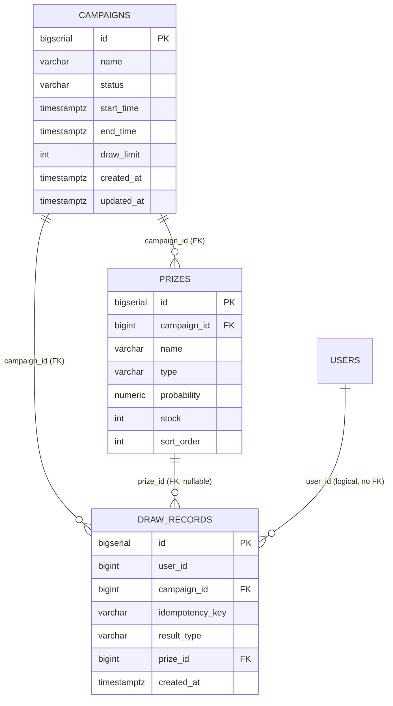

# Campaign DB — 資料庫設計 (Database Design)

## 1. 文件資訊

| 項目 | 內容 |
|------|------|
| **狀態 (Status)** | Proposed |
| **日期 (Date)** | 2026-08-14 |
| **角色 (Layer)** | SD — Technical Design |
| **服務** | campaign-service（活動/獎品管理、權重抽獎、冪等控制） |
| **業務語意來源** | [campaign-service SA](../specs/campaign-service/README.md) §5.1~5.3 |

> **層級界線**：本文件定義技術型別、constraint、index。業務語意（欄位意義、合法值、敏感性）見 SA 文件，此處僅以「SA 欄位 → 欄位」映射表連結，不重述。

---

## 2. Table 總覽

| Table | 用途 | 對應 SA 語意 |
|-------|------|-------------|
| `campaigns` | 抽獎活動（生命週期狀態機） | SA §5.1 campaign |
| `prizes` | 獎品（含 THANK_YOU，機率配置） | SA §5.2 prize |
| `draw_records` | 抽獎結果（冪等 + replay 快照） | SA §5.3 draw_record |

---

## 3. DDL（PostgreSQL — prod 真相）

```sql
-- =============================================================
-- Campaign DB — PostgreSQL DDL
-- Service: campaign-service   (ADR-002 schema-per-service)
-- 冪等: ADR-005  權重抽獎/機率: ADR-004  狀態機: FR-CAMP-01
-- =============================================================

-- -------------------------------------------------------------
-- campaigns：抽獎活動
-- 狀態機 DRAFT → ACTIVE → ENDED (FR-CAMP-01)；ENDED 為終態不可回轉
-- -------------------------------------------------------------
CREATE TABLE campaigns (
    id         BIGSERIAL    PRIMARY KEY,
    name       VARCHAR(128) NOT NULL,
    status     VARCHAR(16)  NOT NULL DEFAULT 'DRAFT',
    start_time TIMESTAMPTZ  NOT NULL,
    end_time   TIMESTAMPTZ  NOT NULL,
    draw_limit INT          NOT NULL,   -- 每使用者本活動期間總抽獎次數上限 (>=1)
    created_at TIMESTAMPTZ  NOT NULL DEFAULT now(),
    updated_at TIMESTAMPTZ  NOT NULL DEFAULT now(),

    CONSTRAINT chk_campaigns_status     CHECK (status IN ('DRAFT', 'ACTIVE', 'ENDED')),
    CONSTRAINT chk_campaigns_draw_limit CHECK (draw_limit >= 1),
    CONSTRAINT chk_campaigns_time       CHECK (end_time > start_time)
);

COMMENT ON TABLE  campaigns            IS '抽獎活動（Campaign DB 屬主）';
COMMENT ON COLUMN campaigns.name       IS '活動名稱，非空';
COMMENT ON COLUMN campaigns.status     IS '生命週期狀態：DRAFT/ACTIVE/ENDED（狀態機見 SA §4.1）';
COMMENT ON COLUMN campaigns.start_time IS '活動開始時間（可抽獎起點）';
COMMENT ON COLUMN campaigns.end_time   IS '活動結束時間；個人次數計數 TTL 對齊此時間';
COMMENT ON COLUMN campaigns.draw_limit IS '每使用者本活動整個週期的總抽獎次數上限（非每日重置）';
COMMENT ON COLUMN campaigns.created_at IS '建立時間（UTC）';
COMMENT ON COLUMN campaigns.updated_at IS '更新時間（由 app 層維護，見 §3.2 註記）';

-- -------------------------------------------------------------
-- prizes：獎品（含銘謝惠顧 THANK_YOU，ADR-004）
-- 機率總和 = 100% 為 app-level 驗證 (FR-CAMP-04)，無法用 CHECK 跨 row 表達
-- -------------------------------------------------------------
CREATE TABLE prizes (
    id          BIGSERIAL    PRIMARY KEY,
    campaign_id BIGINT       NOT NULL REFERENCES campaigns(id) ON DELETE CASCADE,
    name        VARCHAR(128) NOT NULL,
    type        VARCHAR(16)  NOT NULL,   -- 'PRIZE' / 'THANK_YOU'
    probability NUMERIC(5,2) NOT NULL,   -- 百分比 [0,100]
    stock       INT          NOT NULL DEFAULT 0,  -- 初始數量；THANK_YOU 不適用（忽略）
    sort_order  INT          NOT NULL DEFAULT 0,  -- 權重抽獎固定順序（ADR-004）

    CONSTRAINT chk_prizes_type        CHECK (type IN ('PRIZE', 'THANK_YOU')),
    CONSTRAINT chk_prizes_probability CHECK (probability >= 0 AND probability <= 100),
    CONSTRAINT chk_prizes_stock       CHECK (stock >= 0)
);

COMMENT ON TABLE  prizes             IS '獎品（含銘謝惠顧；銘謝惠顧建模為 type=THANK_YOU 的獎品）';
COMMENT ON COLUMN prizes.campaign_id IS '所屬活動（FK，刪活動連帶刪獎品）';
COMMENT ON COLUMN prizes.type        IS 'PRIZE（實體獎品）/ THANK_YOU（銘謝惠顧）';
COMMENT ON COLUMN prizes.probability IS '中獎機率 [0,100]；全體（含 THANK_YOU）總和 = 100%（app-level，FR-CAMP-04）';
COMMENT ON COLUMN prizes.stock       IS '初始可發放數量（配置語意）；實際庫存真相在 inventory-service；THANK_YOU 存 0 且忽略';
COMMENT ON COLUMN prizes.sort_order  IS '權重抽獎固定順序（累計機率區間，ADR-004）';

-- 抽獎權重區間排序 + 依活動取獎品清單（快取暖身/配置讀取）
CREATE INDEX idx_prizes_campaign_sort ON prizes (campaign_id, sort_order);

-- -------------------------------------------------------------
-- draw_records：抽獎結果（冪等 + replay 快照，ADR-005）
-- UNIQUE(user_id, campaign_id, idempotency_key) = 冪等最終保證
-- -------------------------------------------------------------
CREATE TABLE draw_records (
    id              BIGSERIAL    PRIMARY KEY,
    user_id         BIGINT       NOT NULL,  -- 邏輯引用 auth.users.id（無跨 DB FK）
    campaign_id     BIGINT       NOT NULL REFERENCES campaigns(id) ON DELETE RESTRICT,
    idempotency_key VARCHAR(36)  NOT NULL,  -- client UUID（ADR-005）
    result_type     VARCHAR(16)  NOT NULL,  -- 'WIN' / 'THANK_YOU'
    prize_id        BIGINT       NULL     REFERENCES prizes(id)   ON DELETE RESTRICT,  -- THANK_YOU 時 NULL
    created_at      TIMESTAMPTZ  NOT NULL DEFAULT now(),

    CONSTRAINT uq_draw_records_idem       UNIQUE (user_id, campaign_id, idempotency_key),
    CONSTRAINT chk_draw_records_result    CHECK (result_type IN ('WIN', 'THANK_YOU')),
    CONSTRAINT chk_draw_records_prize     CHECK (
        (result_type = 'WIN'       AND prize_id IS NOT NULL) OR
        (result_type = 'THANK_YOU' AND prize_id IS NULL)
    )
);

COMMENT ON TABLE  draw_records               IS '抽獎結果（冪等 + replay 快照；抽獎次數的稽核真相）';
COMMENT ON COLUMN draw_records.user_id       IS '執行抽獎之使用者（邏輯引用 auth.users.id，由 JWT sub 決定）';
COMMENT ON COLUMN draw_records.campaign_id   IS '抽獎所屬活動（FK，由請求路徑決定）';
COMMENT ON COLUMN draw_records.idempotency_key IS '冪等識別（client UUID，一次點擊一個）；複合鍵 userId+campaignId+key';
COMMENT ON COLUMN draw_records.result_type   IS 'WIN（中獎）/ THANK_YOU（銘謝惠顧，含庫存不足降級）';
COMMENT ON COLUMN draw_records.prize_id      IS '中獎獎品（WIN 時指向 PRIZE 獎品；THANK_YOU 時 NULL，見 §3.3 決策）';
COMMENT ON COLUMN draw_records.created_at    IS '產生時間（UTC）';

-- 依活動查詢抽獎記錄（管理/稽核，時間倒序）
CREATE INDEX idx_draw_records_campaign_created ON draw_records (campaign_id, created_at DESC);
```

### 3.1 Technical Data Dictionary（SA 欄位 → 欄位）

| SA 欄位 | DB 欄位 | 型別 | Nullable | Constraint | Index |
|---------|---------|------|----------|------------|-------|
| `id` | `campaigns.id` | `BIGSERIAL` | No | PK | PK |
| `name` | `campaigns.name` | `VARCHAR(128)` | No | NOT NULL | — |
| `status` | `campaigns.status` | `VARCHAR(16)` | No | NOT NULL, `CHECK(DRAFT/ACTIVE/ENDED)`, DEFAULT `DRAFT` | — |
| `start_time` | `campaigns.start_time` | `TIMESTAMPTZ` | No | NOT NULL | — |
| `end_time` | `campaigns.end_time` | `TIMESTAMPTZ` | No | NOT NULL, `CHECK(end_time > start_time)` | — |
| `draw_limit` | `campaigns.draw_limit` | `INT` | No | NOT NULL, `CHECK(>= 1)` | — |
| （新增） | `campaigns.created_at` / `updated_at` | `TIMESTAMPTZ` | No | DEFAULT now() | — |
| `name` | `prizes.name` | `VARCHAR(128)` | No | NOT NULL | — |
| `type` | `prizes.type` | `VARCHAR(16)` | No | NOT NULL, `CHECK(PRIZE/THANK_YOU)` | — |
| `probability` | `prizes.probability` | `NUMERIC(5,2)` | No | NOT NULL, `CHECK([0,100])` | — |
| `stock`/`quantity` | `prizes.stock` | `INT` | No | NOT NULL, `CHECK(>= 0)`, DEFAULT 0 | — |
| （新增，排序語意） | `prizes.sort_order` | `INT` | No | NOT NULL, DEFAULT 0 | `idx_prizes_campaign_sort(campaign_id, sort_order)` |
| `user_id` | `draw_records.user_id` | `BIGINT` | No | NOT NULL（邏輯引用，無 FK） | 複合 UNIQUE 前綴 `(user_id, campaign_id)` |
| `campaign_id` | `draw_records.campaign_id` | `BIGINT` | No | NOT NULL, FK→`campaigns` | 複合 UNIQUE 前綴 + `idx_draw_records_campaign_created` |
| `idempotency_key` | `draw_records.idempotency_key` | `VARCHAR(36)` | No | NOT NULL（UUID） | 複合 UNIQUE 尾段 |
| `result_type` | `draw_records.result_type` | `VARCHAR(16)` | No | NOT NULL, `CHECK(WIN/THANK_YOU)` | — |
| `prize_id` | `draw_records.prize_id` | `BIGINT` | **Yes**（THANK_YOU） | FK→`prizes`（RESTRICT）, `CHECK` 與 result_type 對齊 | — |
| 抽獎次數（派生計數） | （**不落 DB 欄位**） | — | — | — | 見 §3.2 註記 |
| （新增） | `draw_records.created_at` | `TIMESTAMPTZ` | No | DEFAULT now() | `idx_draw_records_campaign_created` |

### 3.2 約束與索引摘要

| 型別 | 名稱 | 說明 | 對應需求 |
|------|------|------|---------|
| UNIQUE | `uq_draw_records_idem(user_id, campaign_id, idempotency_key)` | **冪等最終保證**（ADR-005 第二道防線） | `FR-CAMP-13/14` |
| CHECK | `chk_campaigns_status` | 狀態機合法值 | `FR-CAMP-01` |
| CHECK | `chk_campaigns_time` | `end_time > start_time` | SA UC-1 |
| CHECK | `chk_campaigns_draw_limit` | `draw_limit >= 1` | SA UC-1 |
| CHECK | `chk_prizes_type` | `PRIZE`/`THANK_YOU` | `FR-CAMP-03` |
| CHECK | `chk_prizes_probability` | `probability ∈ [0,100]` | `FR-CAMP-06` |
| CHECK | `chk_prizes_stock` | `stock >= 0` | SA §5.2 |
| CHECK | `chk_draw_records_prize` | WIN ⇔ prize_id NOT NULL；THANK_YOU ⇔ NULL | §3.3 |
| FK | `prizes.campaign_id → campaigns` | `ON DELETE CASCADE` | 活動刪除連帶獎品 |
| FK | `draw_records.campaign_id → campaigns` | `ON DELETE RESTRICT` | 保護抽獎歷史（SA UC-1：編輯不失效既有記錄） |
| FK | `draw_records.prize_id → prizes` | `ON DELETE RESTRICT` | 保護抽獎歷史 |
| INDEX | `idx_prizes_campaign_sort` | 權重抽獎固定順序 + 取獎品清單 | ADR-004 |
| INDEX | `idx_draw_records_campaign_created` | 依活動查記錄（時間倒序） | 管理/稽核 |

**註記 — 抽獎次數（派生計數）**：SA §5.3 明確「抽獎次數是『使用者 × 活動』維度的派生計數，不是單一抽獎記錄的欄位」。runtime 由 Redis 計數器 `draw_count:{userId}:{campaignId}` 承載（ADR-003），`draw_records` 是其**稽核真相**（每筆成功抽獎 +1，批次 +N）。因此 Campaign DB **不建立**獨立的 draw_count 表。

**註記 — `updated_at` 維護**：`campaigns.updated_at` 由 app 層維護（Spring Data JPA `@LastModifiedDate`），不建 DB trigger，以利 dev SQLite/H2 共用。

### 3.3 決策：`prize_id` 對銘謝惠顧為 NULL

- SA §5.3 語意將 `prize_id` 記為「銘謝惠顧時指向 `THANK_YOU` 獎品」；本 SD 設計採 **`THANK_YOU` 時 `prize_id = NULL`**，理由：
  1. `result_type = 'THANK_YOU'` 已完整表達「銘謝惠顧」語意，不需再冗餘指向 `THANK_YOU` 獎品列。
  2. 與 runtime 流程一致（`draw-flow.md`：THANK_YOU 落庫不帶 prize_id）。
  3. 以 `CHECK (result_type ↔ prize_id nullability)` 固化「WIN 必有獎品、THANK_YOU 必無獎品」的不變量，避免資料矛盾。
- 此差異已記錄於本文件與驗證報告，若後續採納 SA 原語意（THANK_YOU 亦指向 THANK_YOU 獎品），僅需移除該 CHECK 並改為 `prize_id NOT NULL`。

---

## 4. dev profile 差異（SQLite / H2）

| 欄位/語法 | PostgreSQL (prod) | SQLite (dev) | H2 (dev) |
|-----------|-------------------|--------------|----------|
| `id` | `BIGSERIAL` | `INTEGER PRIMARY KEY AUTOINCREMENT` | `BIGINT AUTO_INCREMENT` |
| `status`/`type`/`result_type` | `VARCHAR(n)` + CHECK | 同左（CHECK 由 SQLite 強制） | 同左 |
| `probability` | `NUMERIC(5,2)` | `NUMERIC`（近似 REAL，浮點誤差） | `NUMERIC(5,2)` |
| `start_time`/`end_time` | `TIMESTAMPTZ` | `TEXT`（ISO-8601） | `TIMESTAMP WITH TIME ZONE` |
| `created_at DESC` index | 支援 | 支援 | 支援 |

> ⚠️ `probability` 在 SQLite 的 `NUMERIC` 近似可能造成「總和 100%」驗證（`FR-CAMP-04`）的浮點容差需要更寬容的 dev 參數；prod 用 `NUMERIC(5,2)` 精確十進位，無此問題。

---

## 5. ER 圖 (ER Diagram)


