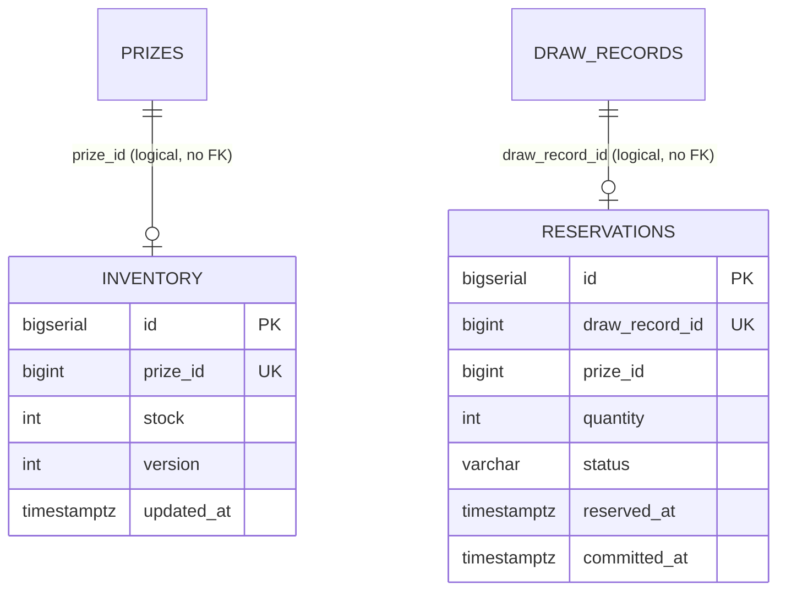

# Inventory DB — 資料庫設計 (Database Design)

## 1. 文件資訊

| 項目 | 內容 |
|------|------|
| **狀態 (Status)** | Proposed |
| **日期 (Date)** | 2026-08-14 |
| **角色 (Layer)** | SD — Technical Design |
| **服務** | inventory-service（庫存扣減真相來源、冪等、補償、對帳） |
| **業務語意來源** | [inventory-service SA](../specs/inventory-service/README.md) §5.1~5.2 |

> **層級界線**：本文件定義技術型別、constraint、index。業務語意（欄位意義、合法值）見 SA 文件，此處僅以「SA 欄位 → 欄位」映射表連結，不重述。

---

## 2. Table 總覽

| Table | 用途 | 對應 SA 語意 |
|-------|------|-------------|
| `inventory` | 庫存真相來源（剩餘可出貨數量） | SA §5.1 inventory |
| `reservations` | 預留/扣減記錄（冪等 + 生命週期 + 補償） | SA §5.2 扣減記錄 |

> 命名對照：ADR-002 的 Inventory DB 核心 table 為 `inventory`（庫存）與 `reservations`（預留記錄）；SA §5.2 將扣減記錄泛稱「deductions」，本文件採 ADR-002 的正式 table 名 `reservations`。

---

## 3. DDL（PostgreSQL — prod 真相）

```sql
-- =============================================================
-- Inventory DB — PostgreSQL DDL
-- Service: inventory-service   (ADR-002 Database-Per-Service)
-- 防超抽: ADR-006（條件更新為真相）  冪等: ADR-005/006
-- =============================================================

-- -------------------------------------------------------------
-- inventory：庫存真相來源（source of truth）
-- prize_id 為跨 DB 邏輯引用（指向 campaign.prizes.id），無跨 DB FK
-- -------------------------------------------------------------
CREATE TABLE inventory (
    id         BIGSERIAL   PRIMARY KEY,
    prize_id   BIGINT      NOT NULL,   -- 邏輯引用 campaign.prizes.id（無跨 DB FK）
    stock      INT         NOT NULL,   -- 剩餘可出貨數量（真相），扣減保證 >= 0
    version    INT         NOT NULL DEFAULT 0,   -- 樂觀鎖（optimistic lock）
    updated_at TIMESTAMPTZ NOT NULL DEFAULT now(),

    CONSTRAINT uq_inventory_prize_id UNIQUE (prize_id),
    CONSTRAINT chk_inventory_stock   CHECK (stock >= 0)
);

COMMENT ON TABLE  inventory           IS '庫存真相來源（每個 PRIZE 獎品一列；THANK_YOU 無此列）';
COMMENT ON COLUMN inventory.prize_id  IS '對應獎品識別（邏輯引用 campaign.prizes.id，UNIQUE）';
COMMENT ON COLUMN inventory.stock     IS '剩餘可出貨數量（唯一真相）；只能扣減，不得為負';
COMMENT ON COLUMN inventory.version   IS '樂觀鎖版本號（app 層條件更新輔助，ADR-003 替代方案保留）';
COMMENT ON COLUMN inventory.updated_at IS '最後異動時間（UTC）';

-- -------------------------------------------------------------
-- reservations：預留/扣減記錄（冪等鍵 draw_record_id，ADR-005/006）
-- 生命週期：RESERVED → COMMITTED（成功）/ REVERSED（補償 or 超時回收）
-- -------------------------------------------------------------
CREATE TABLE reservations (
    id             BIGSERIAL    PRIMARY KEY,
    draw_record_id BIGINT       NOT NULL,  -- 冪等鍵：邏輯引用 campaign.draw_records.id（無跨 DB FK）
    prize_id       BIGINT       NOT NULL,  -- 邏輯引用 campaign.prizes.id（無跨 DB FK）
    quantity       INT          NOT NULL DEFAULT 1,  -- POC 恆為 1
    status         VARCHAR(16)  NOT NULL DEFAULT 'RESERVED',
    reserved_at    TIMESTAMPTZ  NOT NULL DEFAULT now(),  -- 確認時間 = 超時回收基準
    committed_at   TIMESTAMPTZ  NULL,                    -- COMMITTED 時填入

    CONSTRAINT uq_reservations_draw_record_id UNIQUE (draw_record_id),
    CONSTRAINT chk_reservations_quantity      CHECK (quantity >= 1),
    CONSTRAINT chk_reservations_status        CHECK (status IN ('RESERVED', 'COMMITTED', 'REVERSED')),
    CONSTRAINT chk_reservations_committed_at  CHECK (
        (status = 'COMMITTED' AND committed_at IS NOT NULL) OR
        (status <> 'COMMITTED' AND committed_at IS NULL)
    )
);

COMMENT ON TABLE  reservations               IS '預留/扣減記錄（冪等去重 + 生命週期 + 補償追蹤）';
COMMENT ON COLUMN reservations.draw_record_id IS '冪等鍵：對應一筆上游抽獎記錄（UNIQUE，ADR-005/006）';
COMMENT ON COLUMN reservations.prize_id       IS '扣減之獎品（邏輯引用 campaign.prizes.id）';
COMMENT ON COLUMN reservations.quantity       IS '扣減件數（POC 每次抽獎恆 = 1）';
COMMENT ON COLUMN reservations.status         IS '生命週期：RESERVED（已確認待扣減）/ COMMITTED（已扣減）/ REVERSED（已撤銷）';
COMMENT ON COLUMN reservations.reserved_at    IS '確認時間；超時未完成回收（FR-INV-05）之基準';
COMMENT ON COLUMN reservations.committed_at   IS '扣減完成時間（僅 COMMITTED 填值）';

-- 依獎品查預留（對帳/稽核）
CREATE INDEX idx_reservations_prize_id ON reservations (prize_id);
-- 帳目校對掃描：逾時未完成的 RESERVED（UC-3 超時回收）
CREATE INDEX idx_reservations_status_reserved_at ON reservations (status, reserved_at);
```

### 3.1 Technical Data Dictionary（SA 欄位 → 欄位）

| SA 欄位 | DB 欄位 | 型別 | Nullable | Constraint | Index |
|---------|---------|------|----------|------------|-------|
| `prize_id` | `inventory.prize_id` | `BIGINT` | No | `UNIQUE`, NOT NULL（邏輯引用） | `uq_inventory_prize_id` |
| `stock`/`remaining` | `inventory.stock` | `INT` | No | NOT NULL, `CHECK(>= 0)` | — |
| （新增） | `inventory.id` | `BIGSERIAL` | No | PK | PK |
| （新增，樂觀鎖） | `inventory.version` | `INT` | No | NOT NULL, DEFAULT 0 | — |
| （新增） | `inventory.updated_at` | `TIMESTAMPTZ` | No | DEFAULT now() | — |
| `draw_record_id` | `reservations.draw_record_id` | `BIGINT` | No | `UNIQUE`, NOT NULL（冪等鍵） | `uq_reservations_draw_record_id` |
| `prize_id` | `reservations.prize_id` | `BIGINT` | No | NOT NULL（邏輯引用） | `idx_reservations_prize_id` |
| `quantity` | `reservations.quantity` | `INT` | No | NOT NULL, `CHECK(>= 1)`, DEFAULT 1 | — |
| `status` | `reservations.status` | `VARCHAR(16)` | No | NOT NULL, `CHECK(RESERVED/COMMITTED/REVERSED)`, DEFAULT `RESERVED` | `idx_reservations_status_reserved_at` |
| 確認時間 | `reservations.reserved_at` | `TIMESTAMPTZ` | No | NOT NULL, DEFAULT now() | 複合 `(status, reserved_at)` |
| （新增，完成時間） | `reservations.committed_at` | `TIMESTAMPTZ` | **Yes** | `CHECK` 與 status 對齊 | — |

> **`stock` 語意**：SA §5.2 將「剩餘」與「初始值」並列（`stock`/`remaining`）。本設計 `inventory.stock` 即為「剩餘可出貨數量（真相）」；**初始值**由 campaign-service 的獎品配置（`prizes.stock`）於獎品建立時同步寫入（見 dml-seed.md），之後只遞減。

### 3.2 約束與索引摘要

| 型別 | 名稱 | 說明 | 對應需求 |
|------|------|------|---------|
| UNIQUE | `uq_inventory_prize_id` | 每獎品一列庫存；同時作為條件更新的查詢索引 | ADR-006 |
| UNIQUE | `uq_reservations_draw_record_id` | **冪等去重**（同一中獎只扣一次） | `FR-INV-04` |
| CHECK | `chk_inventory_stock` | `stock >= 0`（防負庫存最後一道 DB 防線） | `FR-INV-02` |
| CHECK | `chk_reservations_quantity` | `quantity >= 1`（POC 恆 1） | SA §5.2 |
| CHECK | `chk_reservations_status` | 生命週期合法值 | SA §4.3 |
| CHECK | `chk_reservations_committed_at` | COMMITTED ⇔ committed_at NOT NULL | §3.3 |
| INDEX | `idx_reservations_prize_id` | 依獎品對帳/稽核 | UC-3 |
| INDEX | `idx_reservations_status_reserved_at` | 帳目校對掃描逾時 RESERVED | `FR-INV-05` |

---

## 3.3 防超抽：條件更新為真相保證（ADR-006）

**DB 是庫存唯一真相來源**。真正的扣減由 inventory-service 的 async consumer（消費 `inventory-commit` event）執行：

```sql
-- 真相扣減：原子條件更新。影響 row count 即為判定結果。
UPDATE inventory
   SET stock = stock - 1,
       version = version + 1,
       updated_at = now()
 WHERE prize_id = :prizeId
   AND stock > 0;
-- rowcount = 1 → 扣減成功（stock 絕不為負）
-- rowcount = 0 → 庫存不足（Redis 期間被清空 / 帳面不一致）→ 補償路徑
```

- **`WHERE stock > 0` 是「絕不超抽」的最終保證**（`FR-INV-02`）：即使 Redis 即時判定層誤判有貨（ADR-006），條件更新也會失敗而非扣成負數。
- 以 `prize_id` 為條件（自然鍵，`uq_inventory_prize_id` 索引命中）；`version` 提供樂觀鎖輔助（若業務改以 `version` 做 CAS 亦可，但**主保證仍是 `stock > 0` 條件**）。
- 熱點扣減走 Redis Lua 預扣（ADR-003），DB 寫入為 async batch 平滑化（ADR-006）。

### 3.4 冪等與生命週期（consuming 流程）

consumer 對每筆 `inventory-commit`（`drawRecordId, prizeId, quantity`）在 Inventory DB **單一 transaction** 內：

1. **冪等檢查**：查 `reservations.draw_record_id`；已存在 → 已處理，直接 ack（ADR-007 at-least-once）。
2. **INSERT reservation**（`status='RESERVED'`，`reserved_at=now()`）。
3. **條件更新**（§3.3）。
4. `rowcount=1` → `UPDATE reservations SET status='COMMITTED', committed_at=now()`。
5. `rowcount=0` → `UPDATE reservations SET status='REVERSED'` + 補償（校正 Redis、告警，UC-2）。

狀態機：

```text
RESERVED ──► COMMITTED  (扣減成功，終態)
    │
    └───────► REVERSED   (終態：庫存不足補償 UC-2 / 超時回收 UC-3)
```

- `reserved_at` 是「超時未完成」判定基準（`FR-INV-05`）；對帳 job 掃描 `status='RESERVED' AND reserved_at < now() - timeout` → 置 `REVERSED` 並回收 Redis 額度。
- `chk_reservations_committed_at` 固化「COMMITTED 必有 committed_at、非 COMMITTED 必無」，避免半完成狀態。

### 3.5 跨 DB 補償的落點（`REVERSED` vs `VOID`）

- campaign-service SA §4.2 註記：`VOID`（撤銷）是 inventory-service 補償語意，**非** campaign DB 的 draw_record result_type。draw_record 的 result_type 只有 `WIN`/`THANK_YOU`。
- 依 ADR-002（無跨 DB 寫入），inventory-service **不能**直接改 campaign DB 的 draw_record。因此補償的記錄落點是 **`reservations.status = 'REVERSED'`**（本 DB），campaign-service 側的中獎結果撤銷語意由事件/告警通知營運處理（SA inventory UC-2 明確：本服務只負責「撤銷 + 校正 + 告警」，不跨 DB 回寫）。

---

## 4. dev profile 差異（SQLite / H2）

| 欄位/語法 | PostgreSQL (prod) | SQLite (dev) | H2 (dev) |
|-----------|-------------------|--------------|----------|
| `id` | `BIGSERIAL` | `INTEGER PRIMARY KEY AUTOINCREMENT` | `BIGINT AUTO_INCREMENT` |
| `status` | `VARCHAR(16)` + CHECK | 同左 | 同左 |
| `reserved_at`/`committed_at` | `TIMESTAMPTZ` | `TEXT`（ISO-8601） | `TIMESTAMP WITH TIME ZONE` |
| `UNIQUE(prize_id)` / `UNIQUE(draw_record_id)` | 支援 | 支援 | 支援 |
| **條件更新 `WHERE stock > 0`** | **行鎖正確、並發語意完整** | 語法支援但並發/鎖語意不同 | 同左 | 併發測試須以 PG 驗證（ADR-002） |

> ⚠️ 防超抽（`FR-INV-02`）與冪等（`FR-INV-04`）的 integration test 務必在 PostgreSQL（Testcontainers / docker-compose）執行，SQLite/H2 僅供地端開發流程驗證，**不得作為防超抽正確性的證據**（ADR-002 後果）。

---

## 5. ER 圖 (ER Diagram)



> `PRIZES` 與 `DRAW_RECORDS` 為 campaign DB 的屬主表，此處以虛線（logical）呈現跨 DB 邏輯引用，**無 FK**（ADR-002）。
